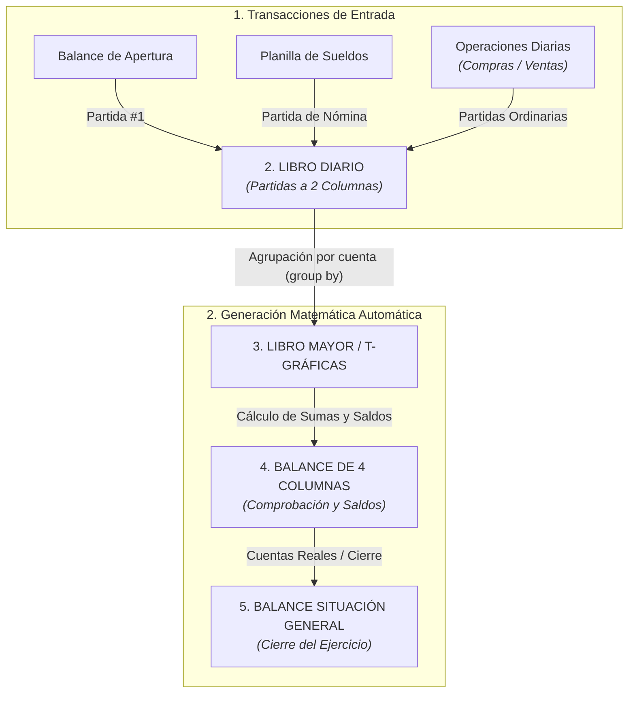

# Sistema Integral de Contabilidad Automatizada (Guatemala)

[](https://www.python.org/downloads/)
[](tests/)
[-orange.svg)](#marco-normativo-y-cumplimiento-legal)

Suite modular de automatización y orquestación contable escrita en Python, diseñada específicamente para cumplir con el marco mercantil y tributario de **Guatemala** (Código de Comercio arts. 368-381, SAT, IGSS y NIIF para PYMES).

El sistema procesa transacciones iniciales y recurrentes para ejecutar de forma desatendida el **Ciclo Contable Clásico**, garantizando integridad matemática estricta a través de aritmética de precisión (`decimal.Decimal`), exportaciones automatizadas a libros de Microsoft Excel (`.xlsx`) y una interfaz de consola enriquecida mediante `rich`.

---

## Flujo del Ciclo Contable

El sistema opera bajo el principio de derivación matemática: a partir del registro inicial de apertura y de los hechos económicos transaccionales, los libros e informes contables posteriores se computan de forma automatizada:



---

## Módulos Principales

### 1. Balance de Situación General (`apertura/`)
- Generación y validación de la Ecuación Patrimonial Fundamental:
  $$\text{Activo} = \text{Pasivo} + \text{Patrimonio Neto}$$
- Clasificación canónica: Activo Corriente/No Corriente (con regularizadoras de depreciación y amortización acumuladas), Pasivo Corriente/No Corriente y Capital Contable.
- Generación automática de la **Partida No. 1 de Apertura** al iniciar el ejercicio fiscal.

### 2. Planilla de Sueldos y Nómina Legal (`planilla/`)
- Procesamiento de personal administrativo y operativo según legislación laboral guatemalteca.
- Deducciones y aportaciones laborales y patronales automáticas:
  - Cuota Laboral IGSS (4.83%).
  - Cuota Patronal (12.67%: IGSS 10.67%, IRTRA 1.00%, INTECAP 1.00%).
  - Bonificación Incentivo (Decreto 78-89: Q250.00 base).
  - Retención de ISR Asalariados y cálculo de sueldo extraordinario (horas extra).
- Generación y vinculación desatendida del asiento contable de nómina al Libro Diario.

### 3. Libro Diario (`diario/`)
- Registro cronológico y correlativo con validación de partida doble inviolable:
  $$\sum \text{Debe} - \sum \text{Haber} = 0.00$$
- Manejo de tipos de asiento predefinidos: apertura, nóminas, compras con Crédito Fiscal IVA (12%), ventas con Débito Fiscal IVA (12%) y partidas de ajuste/depreciación.
- Soporte para comentarios y glosas detalladas de respaldo documental.

### 4. Libro Mayor y T-Gráficas (`mayor/`)
- Clasificación de movimientos débito/crédito agrupados por cuenta contable.
- Vistas duales:
  - **T-Gráficas:** Representación visual didáctica y de auditoría con identificación de partidas de origen.
  - **Mayor a 3 Columnas:** Formato formal de libro comercial con control de saldo continuo (deudor o acreedor).

### 5. Balance de Comprobación y Saldos (`balance/`)
- Balance de 4 Columnas:
  - Columnas 1 y 2: Sumas del Debe y del Haber.
  - Columnas 3 y 4: Saldos Deudor y Acreedor.
- Verificación automática del doble cuadre.
- Generación de estados financieros derivados y balances de cierre.

### 6. Reportes y Exportación (`reportes/` y `persistencia/`)
- Generación de libros de trabajo en Microsoft Excel (`.xlsx`) con estilos profesionales de auditoría, fórmulas automáticas de sumas y bordes contables reglamentarios.
- Persistencia en JSON estructurado (`libro_diario.json`) para pausar y reanudar ejercicios contables.

---

## Requisitos Previos

- **Python 3.10** o superior.
- Gestor de paquetes `pip`.

---

## Instalación

1. **Clonar el repositorio:**
   ```bash
   git clone https://github.com/EmGamex/Accounting-Cycle-on-Python.git
   cd Accounting-Cycle-on-Python
   ```

2. **Crear y activar un entorno virtual:**
   ```bash
   # Linux / macOS
   python -m venv .venv
   source .venv/bin/activate

   # Windows (PowerShell)
   python -m venv .venv
   .\.venv\Scripts\Activate.ps1
   ```

3. **Instalar dependencias:**
   ```bash
   pip install -r requirements.txt
   ```

---

## Guía de Uso

### Menú Principal Interactivo

Inicia el orquestador general del ciclo contable:

```bash
python main.py
```

Desde el menú unificado puedes:
1. Configurar la empresa y el ejercicio contable.
2. Iniciar o cargar el Balance de Apertura.
3. Importar o procesar la Planilla de Sueldos.
4. Registrar operaciones en el Libro Diario.
5. Mayorizar cuentas y generar T-Gráficas.
6. Emitir el Balance de 4 Columnas.
7. Exportar los libros contables completos a Microsoft Excel o reportes de texto.

> [!TIP]
> Puedes importar datos de personal de forma masiva utilizando el archivo [plantilla_empleados.csv](plantilla_empleados.csv) provisto en la raíz del proyecto.

---

## Estructura del Proyecto

```text
Accounting-Cycle-on-Python/
├── apertura/               # Modelos, CLI y generador de Balance de Situación Inicial
├── balance/                # Motor del Balance de 4 Columnas y Estados Financieros
├── diario/                 # Motor contable, validación de partida doble y CLI de Diario
├── mayor/                  # Lógica de mayorización, T-Gráficas y saldos
├── planilla/               # Motor de cálculo laboral y nóminas guatemaltecas
├── persistencia/           # Serialización JSON del ejercicio y estado de cuentas
├── reportes/               # Exportadores a Excel (.xlsx) y formateadores Rich/Texto
├── tests/                  # Suite de pruebas unitarias y de integración (pytest)
├── catalogo_contable.py    # Nomenclatura y catálogo de cuentas normalizado
├── config.py               # Constantes del sistema, impuestos (IVA, IGSS, ISR) y rutas
├── orquestador.py          # Flujo central y enlace entre etapas del ciclo contable
├── main.py                 # Punto de entrada unificado para el usuario
└── requirements.txt        # Dependencias del proyecto
```

---

## Pruebas Automatizadas

El proyecto incluye pruebas unitarias para validar los cálculos fiscales, la regla de partida doble y la consistencia de los balances.

Para ejecutar la suite de pruebas completa:

```bash
pytest
```

Para ejecutar con reporte detallado:

```bash
pytest -v
```

> [!NOTE]
> Los cálculos monetarios utilizan tipos `Decimal` para evitar errores de coma flotante y asegurar consistencia con las reglas contables de centavos.
