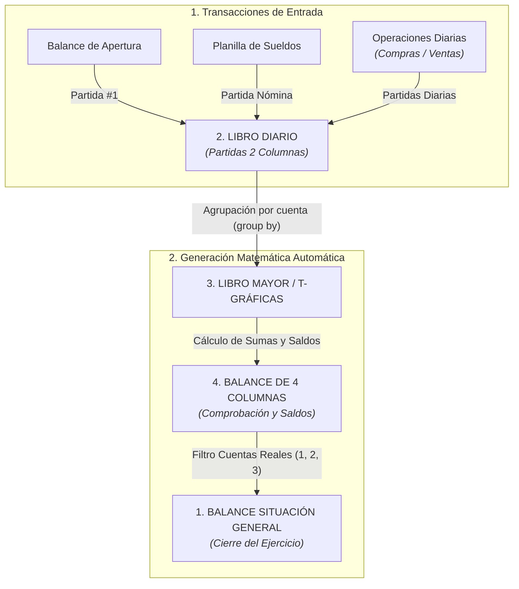
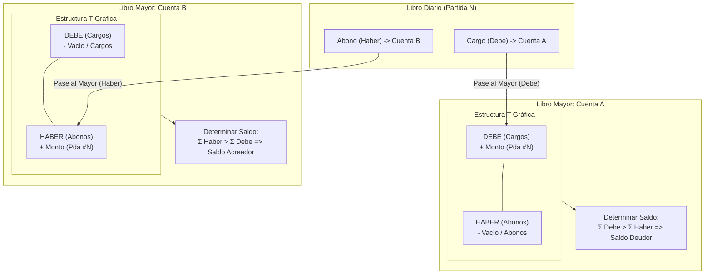
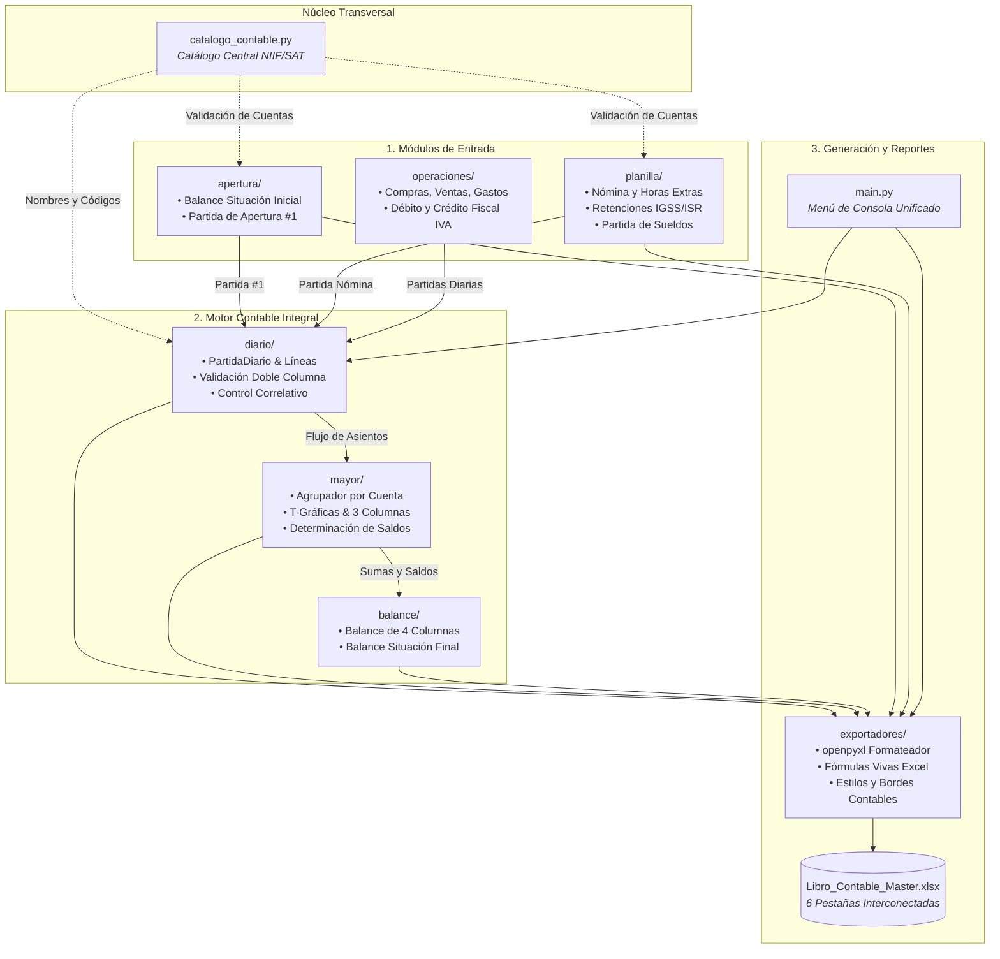
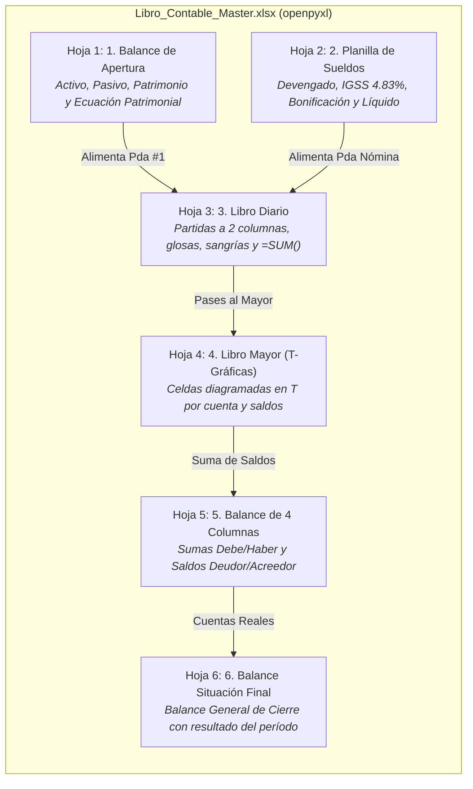
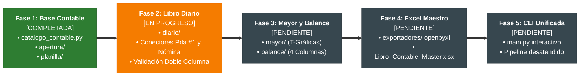

# SISTEMA INTEGRAL DE CONTABILIDAD AUTOMATIZADA
## Especificación de Arquitectura, Flujo de Datos y Modelo de Negocio
**País / Marco Normativo:** Guatemala (Código de Comercio, SAT, IGSS, NIIF para PYMES)  
**Moneda Oficial:** Quetzales (Q)  
**Tecnología Base:** Python 3.10+, Dataclasses fuertemente tipadas, Precisión decimal (`Decimal`), OpenPyXL

---

## 1. Visión General del Proyecto

El objetivo de este proyecto es consolidar una suite de automatización contable completa, modular y libre de descuadres humanos. A partir de los datos iniciales y transaccionales del negocio, el sistema ejecuta de manera desatendida todo el **Ciclo Contable Clásico**, produciendo los libros y reportes oficiales requeridos tanto por la administración interna como por la legislación tributaria y mercantil guatemalteca (Artículos 368 al 381 del Código de Comercio).

### El Efecto Dominó del Ciclo Contable
En la contabilidad formal, el usuario **únicamente debe registrar los hechos económicos** (apertura, compras, ventas y nómina). Los libros posteriores son derivados matemáticos puros:



---

## 2. Los 5 Módulos Fundamentales

### Módulo 1: Balance de Situación General (Apertura y Cierre)
* **Propósito:** Mostrar la posición financiera de la entidad en un momento determinado bajo la Ecuación Patrimonial Fundamental:
  $$\text{Activo} = \text{Pasivo} + \text{Patrimonio Neto}$$
* **Estado Actual en el Proyecto:** Ya desarrollado en el paquete `apertura/`.
* **Estructura Requerida:**
  * **Activo Corriente:** Caja, Bancos, Cuentas por Cobrar, Inventarios, Crédito Fiscal IVA, Pagos Anticipados.
  * **Activo No Corriente:** Inmuebles, Vehículos, Mobiliario y Equipo, Maquinaria, menos sus respectivas **Cuentas Regularizadoras** (Depreciaciones y Amortizaciones Acumuladas).
  * **Pasivo Corriente:** Proveedores, Cuentas por Pagar, Retenciones IGSS/ISR por Pagar, IVA por Pagar.
  * **Pasivo No Corriente:** Préstamos Bancarios Largo Plazo, Provisiones para Indemnizaciones.
  * **Capital / Patrimonio Neto:** Capital Social / Individual, Reserva Legal, Resultados Acumulados y Resultado del Ejercicio.
* **Integración al Diario:**
  * Al iniciar operaciones, genera automáticamente la **Partida #1 de Apertura**.
  * Al cierre del ejercicio, toma los saldos residuales del Balance de 4 Columnas para emitir el **Balance de Situación General de Cierre**.

---

### Módulo 2: Libro Diario — Partidas a 2 Columnas
* **Propósito:** Registro cronológico, fiel y correlativo de todas las operaciones económicas del negocio (Debe y Haber).
* **Especificaciones del Formato Legal Guatemalteco:**
  * Número de asiento correlativo estricto (`Partida No. 1`, `Partida No. 2`, etc.).
  * Fecha de devengo contable (`DD/MM/AAAA`).
  * Códigos de cuenta normalizados según el Catálogo Contable Central (`catalogo_contable.py`).
  * Nombres de cuenta cargadas al margen izquierdo (**Debe**).
  * Nombres de cuenta abonadas con sangría reglamentaria hacia la derecha (**Haber**).
  * **Glosa o Explicación:** Descripción concisa del motivo del asiento, documentos que lo respaldan (facturas, cheques, boletas de banco).
  * **Doble Columna:** Columna izquierda para débitos (Debe) y columna derecha para créditos (Haber).
  * **Línea de Cuadre:** Sumas iguales al pie de cada partida con doble subrayado.
* **Fuentes de Alimentación:**
  1. *Partida de Apertura:* Heredada directamente desde `apertura/`.
  2. *Partidas de Nómina:* Heredadas quincenal o mensualmente desde `planilla/`.
  3. *Partidas de Compras y Gastos:* Reconocimiento de gasto/activo + Crédito Fiscal IVA (12%) contra caja/bancos o proveedores.
  4. *Partidas de Ventas y Servicios:* Reconocimiento de ingreso ordinario + Débito Fiscal IVA (12%) contra caja/bancos o clientes.
  5. *Partidas de Depreciación y Ajustes:* Cálculo periódico automático según porcentajes máximos legales de la Ley de Actualización Tributaria (Vehículos 20%, Mobiliario 20%, Edificios 5%, etc.).
* **Regla de Integridad Inviolable:**
  $$\sum \text{Debe} - \sum \text{Haber} = 0.00$$
  El sistema bloquea cualquier asiento que tenga una diferencia distinta de cero.

---

### Módulo 3: Libro Mayor (O T-Gráficas)
* **Propósito:** Clasificar y acumular de forma individual los movimientos que ha sufrido cada una de las cuentas contables a lo largo del período.
* **Modos de Presentación:**
  1. **T-Gráficas (Visual / Didáctico / Auditoría):**
     * Una gráfica en forma de "T" para cada cuenta del catálogo que haya tenido movimientos.
     * En el brazo izquierdo: lista de cargos con referencia al número de partida que le dio origen.
     * En el brazo derecho: lista de abonos con referencia al número de partida.
     * Al pie de la T: Suma del Debe, Suma del Haber y determinación del Saldo (Deudor o Acreedor).
  2. **Libro Mayor Formal a 3 Columnas (Presentación de Libro de Comercio):**
     * Encabezado con el código, nombre y folio de la cuenta.
     * Tabla con columnas: `Fecha`, `No. Partida`, `Concepto`, `Debe`, `Haber`, `Saldo Actual`.



* **Lógica de Saldo:**
  * Si $\sum \text{Debe} > \sum \text{Haber} \implies$ **Saldo Deudor** (típico en Activos, Costos y Gastos).
  * Si $\sum \text{Haber} > \sum \text{Debe} \implies$ **Saldo Acreedor** (típico en Pasivos, Patrimonio e Ingresos).

---

### Módulo 4: Balance de 4 Columnas (Comprobación y Saldos)
* **Propósito:** Verificar la exactitud aritmética de todos los pases del Diario al Mayor antes de emitir los estados financieros finales.
* **Estructura de las 4 Columnas:**

| No. | Código | Nombre de la Cuenta | Col. 1: Suma Debe | Col. 2: Suma Haber | Col. 3: Saldo Deudor | Col. 4: Saldo Acreedor |
| :---: | :---: | :--- | :---: | :---: | :---: | :---: |
| 1 | 1101 | Caja General | Q 25,000.00 | Q 10,000.00 | Q 15,000.00 | — |
| 2 | 2101 | Proveedores Locales | Q 5,000.00 | Q 18,000.00 | — | Q 13,000.00 |
| ... | ... | ... | ... | ... | ... | ... |
| | | **SUMAS IGUALES:** | **Q XXX,XXX.XX** | **Q XXX,XXX.XX** | **Q YYY,YYY.YY** | **Q YYY,YYY.YY** |

* **Pruebas de Verificación Matemática:**
  1. $\sum \text{Columna 1 (Sumas Debe)} = \sum \text{Columna 2 (Sumas Haber)}$
  2. $\sum \text{Columna 3 (Saldo Deudor)} = \sum \text{Columna 4 (Saldo Acreedor)}$
  * Si ambas condiciones se cumplen con `Decimal('0.00')` de diferencia, el balance se aprueba formalmente.

---

### Módulo 5: Planillas de Sueldos y Salarios
* **Propósito:** Liquidación periódica de nómina conforme al Código de Trabajo y la legislación de seguridad social y fiscal guatemalteca.
* **Estado Actual en el Proyecto:** Ya desarrollado en el paquete `planilla/`.
* **Cálculos Implementados y Parametrizados:**
  * **Devengado:** Sueldo Base + Sueldo Extraordinario (Horas extras con recargo 1.5x) + Comisiones sobre ventas.
  * **Bonificación Incentivo de Ley:** Q 250.00 mensuales fijos (Decreto 78-89 y 37-2001 del Congreso de la República, exento de IGSS).
  * **Deducciones Laborales:**
    * Cuota Laboral IGSS: **4.83%** sobre total afecto (excluyendo bonificación legal).
    * Retención ISR Asalariados: Cálculo proyectado anual según Decreto 10-2012 con deducción única de Q 48,000.00 y cuota IGSS proyectada.
    * Anticipos de sueldo, préstamos o descuentos judiciales.
  * **Cargas y Provisiones Patronales:**
    * Cuota Patronal IGSS / IRTRA / INTECAP: **12.67%** (10.67% IGSS + 1.00% IRTRA + 1.00% INTECAP).
    * Provisiones laborales: Aguinaldo (8.33%), Bono 14 (8.33%), Vacaciones (4.17%), Indemnización (8.33%).
* **Conexión Directa al Libro Diario:**
  * Consolida automáticamente las cuentas de gasto (Sueldos Admin, Sueldos Ventas, Cuota Patronal, Bonificaciones) al **Debe** y las cuentas de pasivo (Retenciones por Pagar, IGSS por Pagar, Bancos) al **Haber**.

---

### 3. Arquitectura del Software y Estructura de Módulos



### Organización del Repositorio

```
./ (directorio raíz del proyecto)
│
├── SISTEMA_CONTABLE_INTEGRAL.md    # [ESTE DOCUMENTO] Especificación global del sistema
├── catalogo_contable.py            # Catálogo Central NIIF/SAT y motor de búsqueda
│
├── apertura/                       # [Módulo 1] Apertura y Balance Inicial
│   ├── models.py                   # Dataclasses de apertura y balance
│   ├── catalogo.py                 # Servicio de consulta del catálogo
│   ├── contabilidad.py             # Motor de cuadre y cálculo de capital
│   └── cli.py                      # CLI interactivo y flujo de apertura
│
├── reportes/                       # Paquete unificado de reportes contables y texto
│   ├── formato.py                  # Formateo canónico de moneda (Q) y utilidades visuales
│   ├── partidas.py                 # Renderizador universal de asientos contables
│   ├── libro_diario.py             # Emisión y resumen formal del Libro Diario
│   ├── balance.py                  # Balance de Apertura y exportación
│   └── exportador.py               # Guardado físico seguro en disco (UTF-8)
│
├── planilla/                       # [Módulo 5] Nómina y Prestaciones
│   ├── models.py                   # Dataclasses de empleados y boletas
│   ├── calculos.py                 # Tasas IGSS (4.83%, 12.67%), ISR, horas extras
│   ├── contabilidad.py             # Generador de la partida contable de nómina
│   └── io_handlers.py              # E/S consola, CSV y boletas
│
├── diario/                         # [Módulo 2] NUEVO - Motor del Libro Diario
│   ├── models.py                   # PartidaDiario, MovimientoLinea, LibroDiarioModel
│   ├── engine.py                   # Gestor de partidas, correlativos y validación doble
│   └── conectores.py               # Transforma Apertura y Planilla en PartidaDiario
│
├── mayor/                          # [Módulo 3] NUEVO - Motor del Libro Mayor
│   ├── models.py                   # CuentaMayor, MovimientoT, ResumenMayor
│   └── engine.py                   # Agrupa Diario por cuenta, genera T-Gráficas y saldos
│
├── balance/                        # [Módulo 4 y 1-Cierre] NUEVO - Balance de Comprobación
│   ├── models.py                   # FilaBalance4Columnas, BalanceComprobacionModel
│   └── engine.py                   # Genera las 4 columnas y el Balance General final
│
├── exportadores/                   # Motor de Salida en Excel y Reportes
│   ├── excel_diario.py             # Formato Libro Diario a 2 columnas
│   ├── excel_mayor.py              # Formato Libro Mayor y T-Gráficas
│   ├── excel_balance.py            # Formato Balance de 4 Columnas
│   └── excel_master.py             # Generador del Workbook maestro con todas las hojas
│
├── main.py                         # Menú unificado del Sistema Contable
└── tests/                          # Suite de pruebas automatizadas (pytest)
```

---

## 4. Diseño del Libro Excel Maestro (`Libro_Contable_Master.xlsx`)

El producto final más valioso para la empresa o cliente es un único archivo de Excel generado mediante `openpyxl`, con fórmulas vivas, formatos de moneda guatemalteca (`Q #,##0.00`) y estructura legal por pestañas:



---

## 5. Reglas Técnicas y Contables Críticas

1. **Precisión Numérica Absoluta:**
   * Jamás usar números de punto flotante primitivos (`float`) para valores monetarios.
   * Todos los montos deben manejarse con `decimal.Decimal` con redondeo bancario estándar `ROUND_HALF_UP` a 2 posiciones decimales (`Decimal("0.01")`).
2. **Compatibilidad con Normas Tributarias de Guatemala:**
   * IVA general: $12\%$ incluido en precios brutos ($\text{Base} = \text{Total} / 1.12$, $\text{IVA} = \text{Base} \times 0.12$).
   * Tasa IGSS Laboral: $4.83\%$.
   * Tasa IGSS Patronal: $10.67\%$ IGSS $+ 1\%$ IRTRA $+ 1\%$ INTECAP $= 12.67\%$.
   * Bonificación Incentivo Decreto 78-89: Q 250.00 fijos al mes por empleado.
3. **Validación de Partida Doble en Tiempo Real:**
   * Ninguna partida se registra en el Libro Diario si la diferencia entre la sumatoria del Debe y la sumatoria del Haber es distinta de `0.00`.
4. **Trazabilidad y Auditoría:**
   * Cada línea en el Libro Mayor debe guardar el número de partida del Diario de donde provino.
   * Cada fila del Balance de 4 Columnas debe coincidir exactamente con el saldo de su T-Gráfica respectiva.

---

## 6. Hoja de Ruta de Implementación



* **Fase 1 (Completada):**
  - [x] Catálogo Contable Jerárquico NIIF/SAT (`catalogo_contable.py`).
  - [x] Módulo de Balance de Apertura y Partida #1 (`apertura/`).
  - [x] Módulo de Planilla de Sueldos con Partida Contable (`planilla/`).
* **Fase 2 (Completada):**
  - [x] Crear el módulo `diario/` con la estructura unificada de `PartidaDiario`.
  - [x] Crear conectores para que `apertura` y `planilla` alimenten directamente al Diario.
  - [x] Permitir ingreso de partidas operativas adicionales (ventas, compras, cobros, pagos).
* **Fase 3 (En Progreso):**
  - [x] Crear el módulo `mayor/` que agrupe automáticamente el Diario y genere las T-Gráficas.
  - [ ] Crear el módulo `balance/` que tome el Mayor y produzca la matriz de 4 Columnas.
* **Fase 4:**
  - [ ] Implementar los exportadores a Excel (`openpyxl`) para generar el libro maestro de 6 hojas listo para impresión y entrega legal.
* **Fase 5:**
  - [x] Menú de consola amigable e interactivo (`main.py`) que permita operar todo el flujo con 1 solo comando.
