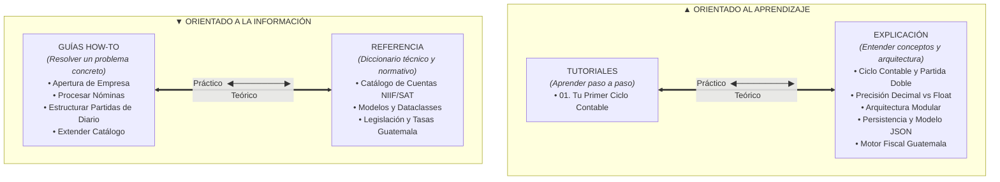
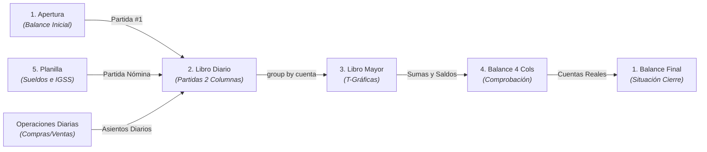

# Centro de Documentación — Sistema Contable Automatizado

Bienvenido a la documentación oficial del **Sistema Contable Automatizado**, una suite modular desarrollada en Python para la gestión completa del Ciclo Contable bajo el marco legal y tributario de **Guatemala** (Código de Comercio, SAT, IGSS y NIIF para PYMES).

Esta documentación está estructurada bajo el **Marco Diátaxis**, separando sistemáticamente la información en cuatro cuadrantes según el objetivo del lector:

---

---

## Flujo del Ciclo Contable en el Sistema

---

### 1. [Tutoriales (Tutorials)](tutorials/)
*Orientados al aprendizaje práctico para usuarios o desarrolladores nuevos.*
* **[01. Tu Primer Ciclo Contable](tutorials/01_primer_ciclo_contable.md)**: Guía paso a paso desde el registro del inventario inicial y la Partida de Apertura hasta la liquidación de la primera planilla de sueldos.

### 2. [Guías Prácticas (How-To Guides)](how-to/)
*Recetas orientadas a resolver problemas o tareas específicas de negocio.*
* **[Cómo Registrar la Apertura de una Empresa](how-to/registrar_apertura_empresa.md)**: Inventario inicial, cuentas regularizadoras de activo y cálculo del capital.
* **[Cómo Procesar Nóminas y Planillas](how-to/procesar_nomina_y_planillas.md)**: Cálculo de horas extras, comisiones, retenciones de IGSS e ISR, y generación de boletas.
* **[Cómo Estructurar Partidas en el Libro Diario](how-to/estructurar_partidas_diario.md)**: Reglas de sangrías, glosas y verificación matemática de doble columna (Debe/Haber).
* **[Cómo Extender el Catálogo de Cuentas](how-to/extender_catalogo_cuentas.md)**: Agregar nuevas cuentas y subcuentas manteniendo la jerarquía NIIF.

### 3. [Referencia Técnica (Reference)](reference/)
*Descripciones técnicas, diccionarios de datos y parámetros legales.*
* **[Catálogo de Cuentas NIIF/SAT](reference/catalogo_cuentas.md)**: Nomenclatura completa, códigos, nombres y clasificación por clase/subgrupo.
* **[Modelos y Dataclasses](reference/modelos_y_dataclasses.md)**: Estructuras de datos fuertemente tipadas (`apertura.models`, `planilla.models`, `diario.models`, `persistencia.models`).
* **[Legislación y Parámetros Fiscales de Guatemala](reference/legislacion_y_tasas_guatemala.md)**: Porcentajes vigentes de IGSS (4.83% y 12.67%), Bonificación Q250.00, IVA 12% y retención ISR.

### 4. [Explicación y Arquitectura (Explanation)](explanation/)
*Artículos de fondo para comprender los fundamentos teóricos y de diseño.*
* **[Arquitectura y Diseño Modular del Software](explanation/arquitectura_del_sistema.md)**: Visión global de subsistemas, arquitectura en capas, reportes y hoja de ruta Excel.
* **[El Ciclo Contable y el Efecto Dominó](explanation/ciclo_contable_y_partida_doble.md)**: Cómo el Diario genera automáticamente el Mayor, las T-Gráficas y el Balance de 4 Columnas.
* **[Precisión Financiera con Decimal](explanation/precision_decimal_financiera.md)**: Por qué se prohíbe el uso de `float` y cómo se garantiza la precisión al centavo.
* **[Persistencia JSON, Snapshots y Modelo Unificado](explanation/persistencia_y_modelo_de_datos.md)**: Serialización estructurada, compatibilidad de esquemas y atomicidad con backups.
* **[Fundamentos del Motor Fiscal y Laboral de Guatemala](explanation/motor_fiscal_guatemala.md)**: Mecánica del IVA (crédito/débito) y provisiones mensuales legales (Aguinaldo, Bono 14, Indemnización).

---

## Resumen del Ciclo Contable Soportado

| Etapa | Módulo | Estado | Entrada Principal | Salida Generada |
| :--- | :--- | :---: | :--- | :--- |
| **1. Apertura** | `apertura/` | Activo | Inventario / Aportaciones | Balance de Situación Inicial y Partida #1 |
| **2. Nómina** | `planilla/` | Activo | Datos de Empleados / Horas | Boletas de Pago y Partida Contable |
| **3. Diario** | `diario/` | Activo | Partidas de Apertura, Nómina y Operativas | Libro Diario oficial a 2 columnas |
| **4. Mayor** | `mayor/` | Activo | Asientos del Libro Diario | T-Gráficas y Mayor agrupado por cuenta |
| **5. Balances** | `balance/` | Activo | Saldos del Libro Mayor | Balance de 4 Columnas y Balance General |
