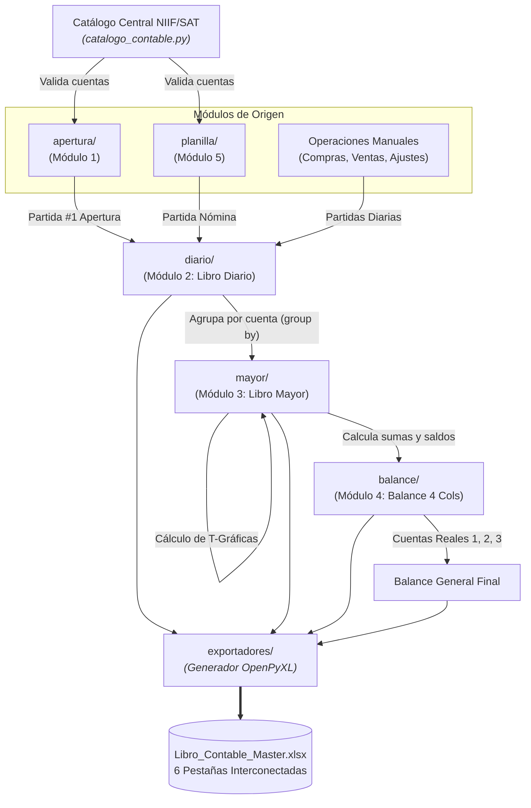

# Explicación: Arquitectura y Diseño Modular del Sistema Contable

Este artículo describe las decisiones de arquitectura de software que sustentan el sistema contable, los patrones de diseño aplicados para garantizar desacoplamiento y alta cohesión, y la hoja de ruta para la exportación a Excel.

---

## 1. Principios de Diseño del Sistema

El desarrollo de este sistema se guía por los siguientes principios de ingeniería de software:

1. **Separación Estricta de Responsabilidades (SoC):**
   * Los modelos de datos (`models.py`) solo almacenan estado y tipos, sin lógica de persistencia o interfaz gráfica.
   * La lógica contable (`contabilidad.py`, `calculos.py`) es agnóstica de si la entrada vino de una consola, un CSV o una llamada web.
   * La capa de interacción (`io_handlers.py`, `reportes.py`, `cli.py`) solo se encarga de formatear cadenas y recibir entradas del usuario.
2. **Inmutabilidad y Tipado Fuerte:**
   * Uso sistemático de `@dataclass` con tipos definidos (`str`, `Decimal`, `bool`, `date`).
   * Eliminación de diccionarios anónimos no tipados en el flujo de procesamiento de partidas.
3. **Validación Preventiva (Fail-Fast):**
   * Ningún asiento erróneo o cuenta inexistente puede transitar de un módulo a otro; se valida en el punto de entrada.

---

## 2. Mapa de Subsistemas e Interacción

---

## 3. Estrategia de Exportación a Excel (`openpyxl`)

Para la generación del libro oficial en Excel ([`Libro_Contable_Master.xlsx`](../../SISTEMA_CONTABLE_INTEGRAL.md)), se adopta una arquitectura de exportadores especializados:

1. **`EstilosExcel` (Tokens visuales reutilizables):**
   * Encabezados con fondo azul corporativo suave (`#1B365D`) y texto en blanco negrita.
   * Celdas numéricas formateadas con máscara contable `_-"Q"* #,##0.00_-;-"Q"* #,##0.00_-;_-"Q"* "-"??_-;_-@_-`.
   * Bordes dobles inferiores contables para sumas iguales (`border_double_bottom`).
2. **Generador de Fórmulas Dinámicas:**
   * En lugar de imprimir valores planos, el exportador escribe fórmulas de Excel nativas (ej. `=SUM(E5:E20)`) para que el archivo mantenga trazabilidad y sea auditable en hojas de cálculo tradicionales.
3. **Pestañas Interconectadas:**
   * Cada una de las 6 hojas (`Balance Apertura`, `Planilla`, `Libro Diario`, `Mayor T`, `Balance 4 Cols`, `Balance Final`) se genera de forma desacoplada dentro de un único `Workbook`.

---

## 4. Estrategia de Pruebas Automatizadas

El sistema utiliza `pytest` con pruebas de integración y unitarias ubicadas en el directorio `tests/`:
* `tests/test_catalogo.py`: Verifica consistencia de árbol de cuentas y búsqueda difusa.
* `tests/test_apertura.py`: Verifica casos de prueba de apertura, activos corrientes/no corrientes y cuentas regularizadoras.
* `tests/test_planillas.py`: Verifica cálculos de IGSS, retención ISR, bonificaciones legales y cuadre de la partida contable.
