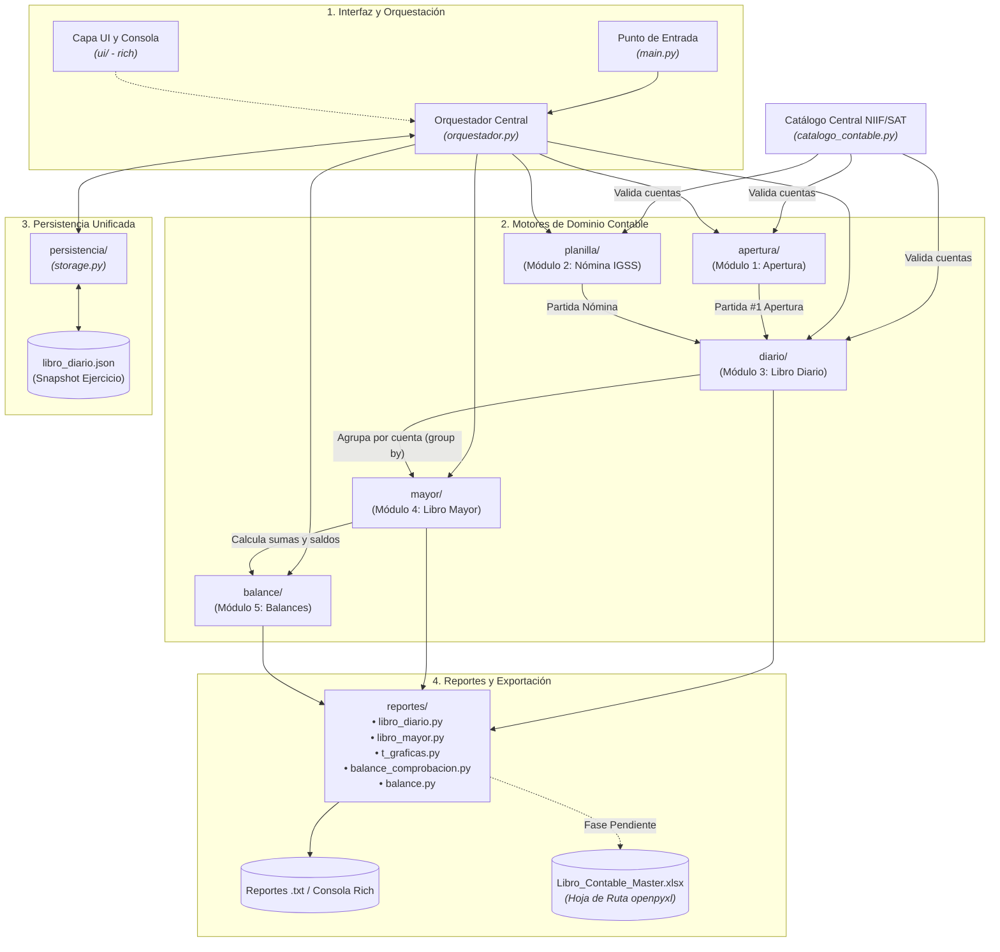

# Explicación: Arquitectura y Diseño Modular del Sistema Contable

Este artículo describe las decisiones de arquitectura de software que sustentan el sistema contable, la estructura en capas (*Layered Architecture*), los patrones de diseño aplicados para garantizar desacoplamiento y alta cohesión, y la hoja de ruta para la exportación a Excel.

---

## 1. Principios de Diseño del Sistema

El desarrollo de este sistema se guía por los siguientes principios de ingeniería de software:

1. **Arquitectura en Capas (Layered Architecture):**
   * **Capa de Interfaz / Consola (`ui/`):** Construida sobre `rich`, proporciona tablas, menús interactivos y formateo visual de moneda (`Q {:,.2f}`) desacoplada de la lógica contable.
   * **Capa de Orquestación (`orquestador.py`, `main.py`):** Controla el flujo general del ciclo contable, valida transiciones entre etapas y gestiona los conectores entre subsistemas.
   * **Capa de Dominio y Motores Contables (`apertura/`, `planilla/`, `diario/`, `mayor/`, `balance/`):** Motores independientes que encapsulan modelos (`models.py`) y lógica contable pura (`engine.py`, `contabilidad.py`).
   * **Capa de Persistencia (`persistencia/`):** Almacenamiento unificado en JSON con validación de integridad y respaldos atómicos.
   * **Capa de Reportes (`reportes/`):** Generadores de reportes especializados (Diario, Mayor a 3 columnas, T-Gráficas, Balance de 4 Columnas y Balance General) exportables a texto y consola.
2. **Inmutabilidad y Tipado Fuerte:**
   * Uso sistemático de `@dataclass` con tipos estrictos (`str`, `Decimal`, `bool`, `date`).
   * Cero tolerancia a diccionarios anónimos no tipados dentro del procesamiento de partidas.
3. **Validación Preventiva (Fail-Fast):**
   * Ningún asiento descuadrado o cuenta inexistente en el catálogo puede transitar de un módulo a otro; la regla de partida doble ($\sum \text{Debe} - \sum \text{Haber} = 0.00$) se fuerza en el punto de captura.

---

## 2. Mapa de Subsistemas e Interacción

---

## 3. Estrategia de Exportación y Hoja de Ruta Excel

El sistema implementa una arquitectura desacoplada para la emisión de informes financieros:

1. **Estado Actual (Reportes Rich y Texto):**
   * El paquete [`reportes/`](../../reportes/) contiene módulos independientes para cada libro contable:
     * `reportes/partidas.py`: Representación en dos columnas con sangrías normativas.
     * `reportes/libro_diario.py`: Folio correlativo cronológico con totales de cierre.
     * `reportes/libro_mayor.py`: Mayor formal a 3 columnas con saldo continuo.
     * `reportes/t_graficas.py`: Representación didáctica y de auditoría de cuentas T.
     * `reportes/balance_comprobacion.py`: Balance de 4 Columnas con doble cuadre.
     * `reportes/balance.py`: Balance de Situación General clasificado.
   * `reportes/exportador.py`: Utilidad para la persistencia física en disco en codificación UTF-8.
2. **Hoja de Ruta: Libro Maestro Excel (`openpyxl`):**
   * La siguiente fase del sistema contempla la integración de `openpyxl` para compilar un único libro de trabajo (`Libro_Contable_Master.xlsx`) con pestañas interconectadas por fórmulas dinámicas nativas (`=SUM(...)`), formatos contables de moneda guatemalteca (`Q #,##0.00`) y estilos corporativos de auditoría.

---

## 4. Estrategia de Pruebas Automatizadas

El sistema cuenta con una exhaustiva suite de pruebas con **20 archivos de prueba** y más de **170 tests unitarios y de integración** ejecutados mediante `pytest`:

* `test_catalogo.py`: Verifica la integridad de la taxonomía contable, cuentas regularizadoras y búsqueda difusa.
* `test_apertura.py` y `test_storage.py`: Pruebas de la ecuación patrimonial y persistencia inicial.
* `test_planillas.py` y `test_planillas_cli.py`: Cálculos de cuota laboral (4.83%), cuota patronal (12.67%), ISR y flujos interactivos.
* `test_diario.py`, `test_diario_cli.py` y `test_diario_fiscal.py`: Reglas de partida doble, desglose de IVA (12%) y asistentes de compras/ventas.
* `test_mayor.py`, `test_mayor_cli.py` y `test_mayor_reportes.py`: Mayorización matemática, control de saldos deudor/acreedor y T-Gráficas.
* `test_balance.py`, `test_balance_cli.py` y `test_balance_reportes.py`: Verificación del doble cuadre en 4 columnas y balance general.
* `test_persistencia_unificada.py`: Serialización JSON completa, respaldos `.bak` y compatibilidad hacia atrás.
* `test_reportes_unificados.py`, `test_ui_modular.py`, `test_config.py` y `test_main.py`: Integración de interfaces, formateo visual y orquestación general.
