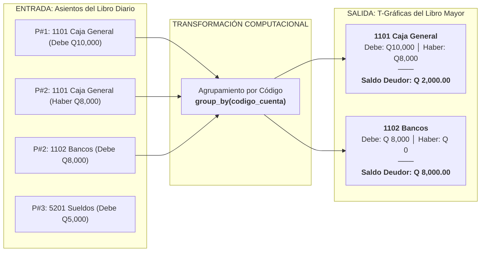

# Explicación: El Ciclo Contable y el Efecto Dominó hacia el Mayor y Balance

Este artículo explica la justificación teórica y matemática de por qué la captura rigurosa en el Libro Diario permite automatizar en un 100% el Libro Mayor (T-Gráficas), el Balance de 4 Columnas y los Estados Financieros finales sin intervención manual adicional.

---

## 1. El Fundamento Matemático de la Partida Doble

La contabilidad por partida doble, formulada originalmente por Fray Luca Pacioli en 1494 y adoptada universalmente, establece que **no hay deudor sin acreedor, ni acreedor sin deudor**.

En términos algebraicos, toda transacción contable $k$ es un vector bidimensional de cargos $D_k$ y abonos $H_k$ tal que:

$$\sum_{i} d_{k, i} = \sum_{j} h_{k, j}$$

Donde $d_{k, i}$ es el monto cargado a la cuenta $i$ y $h_{k, j}$ es el monto abonado a la cuenta $j$.

Por consiguiente, si cada partida individual $k$ cumple con la condición de igualdad estricta, la sumatoria acumulada de todas las partidas del ejercicio contable también debe cumplirla necesariamente:

$$\sum_{k=1}^{N} \sum_{i} d_{k, i} = \sum_{k=1}^{N} \sum_{j} h_{k, j}$$

Esta propiedad transitiva es la que garantiza que los libros derivados cuadren de forma infalible.

---

## 2. La Transformación: De Libro Diario a Libro Mayor

El **Libro Diario** es una secuencia ordenada temporalmente:
$$\text{Diario} = [P_1, P_2, P_3, \dots, P_N]$$

Cada partida contiene líneas que apuntan a diversas cuentas. Por ejemplo:
* $P_1$: Caja (+Q10,000), Capital (-Q10,000)
* $P_2$: Bancos (+Q8,000), Caja (-Q8,000)
* $P_3$: Sueldos (+Q5,000), Bancos (-Q5,000)

### ¿Qué es el Libro Mayor en términos computacionales?
El Libro Mayor no es más que una operación de **agrupamiento por clave** (`GROUP BY codigo_cuenta`):

Dado que el agrupamiento no altera las magnitudes numéricas, la suma de todos los débitos en el Mayor es idéntica a la suma de todos los débitos en el Diario.

---

## 3. La Construcción del Balance de 4 Columnas

El **Balance de Comprobación y Saldos (4 Columnas)** toma directamente los resultados de cada T-Gráfica del Mayor:

1. **Columna 1 (Suma Debe):** $\sum Debe$ de la cuenta.
2. **Columna 2 (Suma Haber):** $\sum Haber$ de la cuenta.
3. **Columna 3 (Saldo Deudor):** Si $\sum Debe > \sum Haber \implies \text{Saldo} = \sum Debe - \sum Haber$.
4. **Columna 4 (Saldo Acreedor):** Si $\sum Haber > \sum Debe \implies \text{Saldo} = \sum Haber - \sum Debe$.

### Demostración del Doble Cuadre:
* Las **Sumas** cuadran porque representan exactamente el total de cargos y abonos del Diario redistribuidos por cuenta:
  $$\sum \text{Columna 1} = \sum \text{Columna 2}$$
* Los **Saldos** cuadran porque la resta de cantidades iguales a ambos lados de una ecuación mantiene la igualdad:
  $$\sum \text{Columna 3 (Saldos Deudores)} = \sum \text{Columna 4 (Saldos Acreedores)}$$

---

## 4. Conclusión y Valor de la Automatización

En los sistemas tradicionales y en la contabilidad manual en papel, los errores de pase (trasladar una cifra con números invertidos del Diario al Mayor, o sumar incorrectamente una columna) consumen incontables horas de búsqueda y conciliación.

Al implementar este flujo en Python:
1. El usuario y los módulos operativos solo se concentran en validar los hechos de origen (Partida de apertura, facturas de compras/ventas, boletas de planilla).
2. El sistema aplica la regla de bloqueo: **ninguna partida con descuadre puede grabarse**.
3. El Mayor, las T-Gráficas y el Balance de 4 Columnas se calculan en milisegundos con exactitud matemática absoluta.
