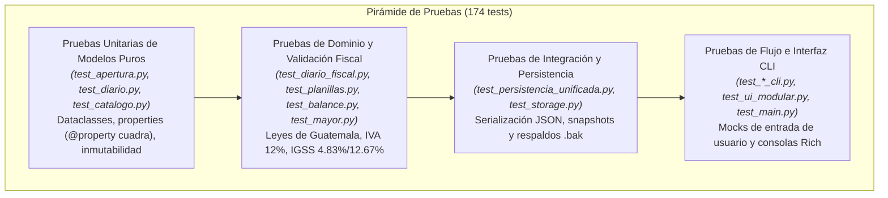

# Explicación: Estrategia de Pruebas y Aseguramiento de Calidad

Este artículo describe la filosofía de verificación, la arquitectura de pruebas automatizadas y los patrones de mocking utilizados para validar la integridad matemática, fiscal y operativa del sistema contable.

---

## 1. Filosofía de Calidad: La Tolerancia Cero al Centavo

En el software de gestión contable, un error de redondeo de $Q 0.01$ no es un defecto cosmético: es un descuadre que invalida la ecuación patrimonial e impide la aprobación de una auditoría tributaria ante la SAT o el Registro Mercantil.

Por esta razón, la estrategia de pruebas se rige por tres principios innegociables:

1. **Aserciones Estrictas sobre Invariantes:** Las pruebas nunca utilizan comparaciones aproximadas (`pytest.approx`) para montos monetarios; comparan valores exactos de `Decimal`.
2. **Determinismo Absoluto:** Todo cálculo laboral (IGSS, horas extras, ISR) y fiscal (IVA) cuenta con casos de prueba basados en liquidaciones precalculadas matemáticamente.
3. **Ejecución Ultrarrápida:** A pesar de contar con más de 170 pruebas, la suite completa se ejecuta en menos de un segundo gracias a la ausencia de bases de datos pesadas o I/O lento en disco.

---

## 2. La Pirámide de Pruebas del Sistema



---

## 3. Patrones de Aislamiento y Mocking

Uno de los mayores desafíos en aplicaciones de consola interactiva enriquecidas con bibliotecas como `rich` es probar los menús y asistentes de captura sin requerir interacción manual humana.

### Mocking de Entradas del Usuario (`builtins.input`)
Se utiliza el mecanismo de patching de `unittest.mock` para simular secuencias completas de pulsaciones de teclado y respuestas de menús:

```python
@patch("builtins.input", side_effect=["caja", "15000", "fin", "S"])
def test_flujo_apertura_interactivo(mock_input):
    resultado = iniciar_flujo_apertura()
    assert resultado.cuadra
    assert resultado.total_debe == Decimal("15000.00")
```

### Aislamiento de la Consola Rich (`ui.console`)
Para evitar contaminar la salida estándar de `pytest` durante ejecuciones continuas de CI/CD:
* Las funciones de presentación envían sus cadenas a una instancia de `rich.console.Console` que puede redirigirse a un búfer en memoria (`StringIO`).
* Se verifican las llamadas a funciones de visualización (`imprimir_exito`, `imprimir_alerta`) para asegurar que el usuario reciba la retroalimentación correcta ante errores.

---

## 4. Cobertura Temática de las Pruebas

| Archivo de Prueba | Ámbito de Cobertura | Tipo de Verificación |
| :--- | :--- | :--- |
| `test_catalogo.py` | Árbol jerárquico NIIF/SAT | Coincidencias exactas, sinónimos y búsqueda difusa. |
| `test_apertura.py` | Balance Inicial | Ecuación patrimonial, activos netos y regularizadoras. |
| `test_planillas.py` | Liquidación Laboral | IGSS laboral (4.83%), cuota patronal (12.67%) y Bonificación Q250. |
| `test_diario.py` | Motor de Libro Diario | Partida doble, correlativos, cargos y abonos. |
| `test_diario_fiscal.py` | Impuestos Guatemala | Desglose de IVA en compras/ventas y facturas mixtas. |
| `test_mayor.py` | Agrupamiento por Cuenta | Sumas, saldos deudores/acreedores y T-Gráficas. |
| `test_balance.py` | Balance de 4 Columnas | Doble cuadre reglamentario y balance de cierre. |
| `test_persistencia_unificada.py` | Almacenamiento JSON | Esquemas v1.0/v1.1, compatibilidad hacia atrás y backups. |
| `test_reportes_unificados.py` | Generadores de Texto | Formateo estricto de tablas `.txt` para auditoría. |

Gracias a esta arquitectura de pruebas, cualquier refactorización o adición al catálogo contable puede ejecutarse con la certeza de que las reglas de negocio e integridad contable permanecen intactas.
