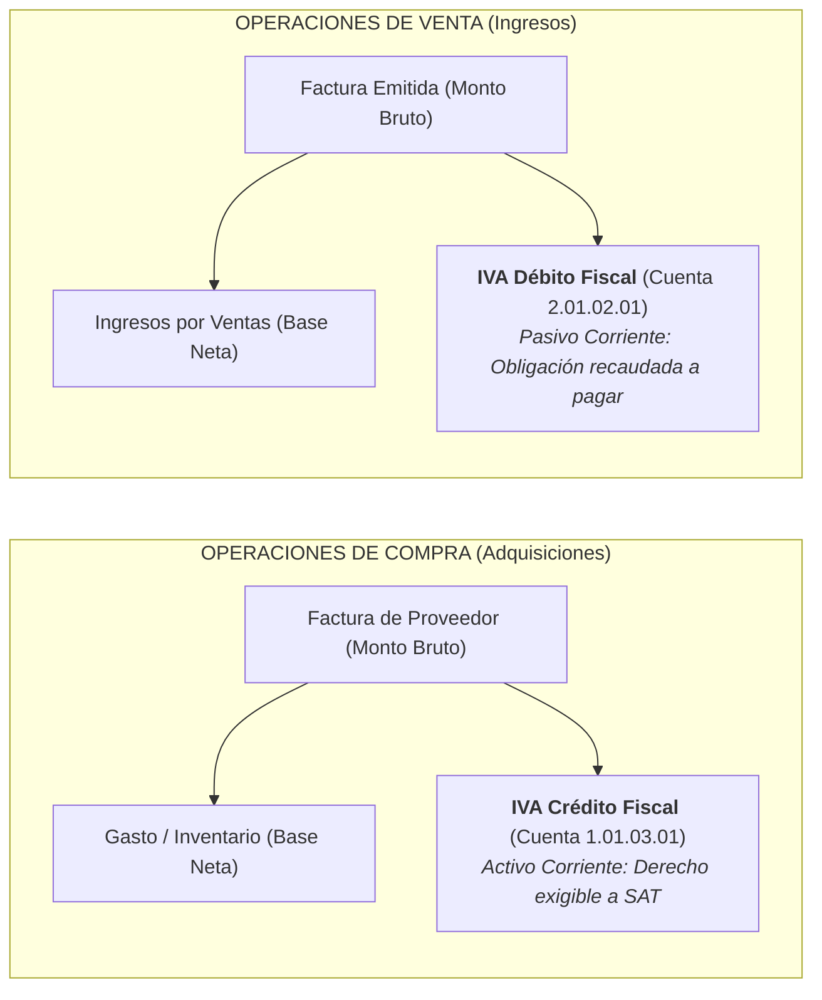

# Explicación: Fundamentos del Motor Fiscal y Laboral de Guatemala

Este artículo detalla la lógica contable y de negocio que sustenta el tratamiento automatizado de impuestos indirectos (IVA) y provisiones laborales conforme a la legislación tributaria y mercantil de la República de Guatemala.

---

## 1. Tratamiento Contable del Impuesto al Valor Agregado (IVA 12%)

En Guatemala, conforme a la **Ley del IVA (Decreto 27-92)**, los precios comerciales al consumidor o entre empresas se expresan casi invariablemente con el impuesto incluido. Sin embargo, el principio contable de devengado exige segregar el impuesto del valor real de los bienes o servicios.

### La Mecánica de Desglose
Dado un monto bruto facturado $M_{\text{bruto}}$:

1. **Base Imponible (Gasto o Ingreso Real):**
   $$\text{Base} = \frac{M_{\text{bruto}}}{1 + \text{TASA\_IVA}} = \frac{M_{\text{bruto}}}{1.12}$$

2. **Cuota Tributaria del IVA:**
   $$\text{IVA} = M_{\text{bruto}} - \text{Base} = \text{Base} \times 0.12$$

Ambos cálculos se ejecutan en [`diario.operaciones.calculos.desglosar_iva`](../../diario/operaciones/calculos.py) empleando aritmética con `Decimal` y redondeo legal `ROUND_HALF_UP` al centavo.

### Crédito Fiscal vs Débito Fiscal

Al cierre del período mensual, la liquidación tributaria consiste simplemente en confrontar:
$$\text{Impuesto a Pagar} = \sum \text{Débito Fiscal} - \sum \text{Crédito Fiscal}$$

---

## 2. Dinámica de Provisiones y Cargas Laborales

Un error común en la contabilidad simplificada es registrar como costo de nómina únicamente el sueldo base pagado en cheque o transferencia. Conforme al **Código de Trabajo** y normas internacionales contables adoptadas en Guatemala:

1. El patrono contrae obligaciones diferidas que se devengan mes a mes, independientemente de cuándo se paguen físicamente.
2. Reconocer estos pasivos mensualmente evita distorsiones patrimoniales en los meses de desembolso masivo (como julio con el Bono 14 o diciembre con el Aguinaldo).

### Cargas Directas y Provisiones Mensuales

En el sistema, cada quincena o fin de mes se liquida la nómina a través del motor [`planilla/`](../../planilla/) y se genera automáticamente la partida contable con las siguientes relaciones matemáticas sobre la masa salarial afecta:

```mermaid
flowchart TD
    Sueldo["Sueldo Devengado Afecto"]

    subgraph GastoInmediato ["Gasto del Período (Estado de Resultados)"]
        SueldosGasto["5.01.01.01 Sueldos"]
        BonifGasto["5.01.01.02 Bonificación Incentivo (Q250/emp)"]
        CuotaPatGasto["5.01.01.03 Cuota Patronal IGSS (12.67%)"]
        ProvGasto["5.01.01.04 Prestaciones Laborales (33.33% total)"]
    end

    subgraph PasivosGenerados ["Pasivos Corrientes (Balance General)"]
        RetIGSS["2.01.02.02 Retenciones IGSS por Pagar (4.83% laboral)"]
        IGSSPatPorPagar["2.01.02.03 Cuota Patronal por Pagar (12.67%)"]
        ProvAguinaldo["2.01.03.01 Provisión para Aguinaldo (8.33% = 1/12)"]
        ProvBono14["2.01.03.02 Provisión para Bono 14 (8.33% = 1/12)"]
        ProvIndemn["2.01.03.03 Provisión para Indemnización (8.33% = 1/12)"]
        ProvVacaciones["2.01.03.04 Provisión para Vacaciones (4.17% = 15/360)"]
        CajaBancos["1.01.01.02 Bancos (Líquido a Recibir)"]
    end

    Sueldo --> SueldosGasto
    Sueldo --> CuotaPatGasto
    Sueldo --> ProvGasto

    Sueldo --> RetIGSS
    Sueldo --> IGSSPatPorPagar
    Sueldo --> ProvAguinaldo & ProvBono14 & ProvIndemn & ProvVacaciones
    Sueldo --> CajaBancos
```

### Justificación de las Tasas de Provisión ([`config.py`](../../config.py))

* **Aguinaldo (Decreto 76-78):** Un salario ordinario promedio por año de servicio ($1/12 \approx 8.33\%$).
* **Bono 14 (Decreto 42-92):** Un salario ordinario promedio por año de servicio ($1/12 \approx 8.33\%$).
* **Indemnización Universal / Legal (Art. 82 Código de Trabajo):** Un mes de salario por año ($1/12 \approx 8.33\%$).
* **Vacaciones (Art. 130 Código de Trabajo):** 15 días hábiles remunerados por año laborado ($15/360 \approx 4.17\%$).

---

## 3. Conclusión

Al codificar estos parámetros legales dentro de [`config.py`](../../config.py) y desacoplarlos de las interfaces de usuario, el software garantiza que cualquier asiento generado por el asistente de compras, ventas o nómina cumpla de forma simultánea con las exigencias de fiscalización de la SAT y los principios de devengado de las NIIF.
