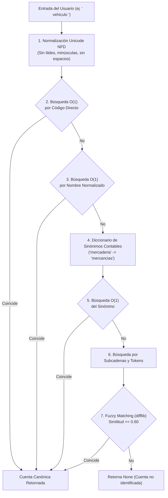

# Explicación: Normalización Lingüística y Búsqueda Difusa de Cuentas

Este artículo explica la arquitectura algorítmica y las decisiones de diseño que permiten al sistema interpretar entradas humanas imperfectas (con errores ortográficos, abreviaturas o variaciones semánticas) y resolverlas en tiempo real hacia cuentas canónicas del Catálogo Contable NIIF/SAT.

---

## 1. El Problema de la Entrada Humana en Sistemas Contables

En la práctica profesional, los usuarios rara vez recuerdan los códigos numéricos exactos de 4 dígitos o escriben los nombres oficiales con su puntuación formal:
* En lugar de `1104 Inventario de Mercancías`, el usuario suele escribir `"mercaderia"`, `"inventario"` o `"mercaderias"`.
* En lugar de `1102 Bancos (Moneda Nacional)`, escriben `"banco"`, `"bancos"` o `"banco bi"`.
* Las tildes y caracteres diacríticos (`Vehículos` vs `vehiculos`, `Depreciación` vs `depreciacion`) provocan fallos en comparaciones de cadenas exactas (`str == str`).

Para evitar rechazos innecesarios sin relajar la rigurosidad contable, el sistema implementa una canalización de procesamiento en cascada en [`apertura.catalogo.CatalogoService`](../../apertura/catalogo.py).

---

## 2. Canalización de Procesamiento en Cascada



---

## 3. Principios Algorítmicos Aplicados

### A. Descomposición Canónica Unicode (NFD)
La función `normalizar(texto: str)` utiliza la descomposición NFD de la biblioteca estándar `unicodedata`:
```python
texto_norm = unicodedata.normalize("NFD", texto)
limpio = "".join(c for c in texto_norm if unicodedata.category(c) != "Mn").lower().strip()
```
Esto separa las letras base de sus marcas diacríticas (la letra `ó` se separa en `o` + `\u0301`), permitiendo filtrar selectivamente las marcas `Mn` (*Mark, nonspacing*). Así, `"Vehículo"` y `"vehiculo"` se transforman en la misma representación canónica.

### B. Indexación en Memoria con Acceso $O(1)$
Al inicializar `CatalogoService`, se construyen diccionarios indexados hash para resolver consultas en tiempo constante:
* `_por_codigo: Dict[str, CuentaCatalogo]`: Mapea códigos como `"1101"`.
* `_por_nombre_norm: Dict[str, CuentaCatalogo]`: Mapea nombres limpios como `"caja general"`.

### C. Mapeo Semántico de Sinónimos
Se incorpora una tabla de equivalencias léxicas comunes en el comercio guatemalteco:
```python
SINONIMOS = {
    "mercaderia": "mercancias",
    "mercaderias": "mercancias",
    "inventario": "inventario de mercancias",
    "banco": "bancos",
    "prestamo": "prestamos bancarios",
    "mobiliario": "mobiliario y equipo",
    "capital": "capital social",
}
```

### D. Similitud Difusa (*Fuzzy Matching*)
Cuando no existe coincidencia exacta o por sinónimo, se activa `difflib.get_close_matches` con un umbral de coincidencia (*cutoff*) del $60\%$:
* Tolera errores tipográficos accidentales (por ejemplo, `"vehicuos"` o `"mobilario"`).
* Si la similitud supera el umbral, el sistema adopta la cuenta candidata más cercana.

---

## 4. Detección Heurística de Cuentas Regularizadoras

En contabilidad financiera, las cuentas de valuación o regularizadoras (como la depreciación acumulada o la estimación de cuentas incobrables) son formalmente de naturaleza acreedora aunque pertenezcan a la clase de Activo.

El motor aplica la regla:
```python
def es_cuenta_regularizadora(nombre: str) -> bool:
    norm = normalizar(nombre)
    return any(p in norm for p in PATRONES_REGULARIZADORAS) or "(-)" in nombre
```
Donde `PATRONES_REGULARIZADORAS` identifica automáticamente prefijos como `"depreciacion acumulada"`, `"amortizacion acumulada"`, `"estimacion para"`, `"reserva para"` o `"-R"`. Esto asegura que el Balance de Apertura reste automáticamente estos importes al calcular el valor neto de los activos antes de computar el Capital Social.
