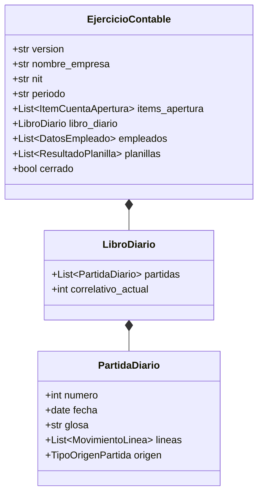
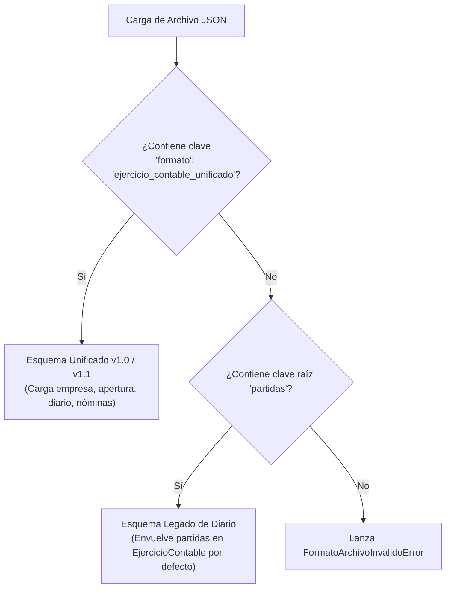

# Explicación: Persistencia JSON, Snapshots y Modelo de Datos Unificado

Este artículo explica las decisiones de diseño del subsistema de persistencia (`persistencia/`), la justificación de utilizar un formato estructurado en JSON para el estado del ejercicio contable, la estrategia de versionado de esquemas y los mecanismos de integridad transaccional implementados en el software.

---

## 1. Justificación del Formato de Persistencia: JSON vs Base de Datos Relacional

Para un sistema contable enfocado en la pequeña y mediana empresa, portabilidad entre plataformas (incluyendo entornos ligeros de consola en Windows, Linux y Termux) y simplicidad de auditoría, se optó por un formato de almacenamiento basado en documentos JSON estructurados frente a una base de datos relacional tradicional (SQLite/PostgreSQL):

1. **Autocontenido y Auditabilidad Directa:**
   * Un ejercicio contable completo puede inspeccionarse, verificarse con herramientas estándar (`jq`, editores de texto) o enviarse a un auditor externo como un único archivo independiente (`libro_diario.json`).
2. **Representación Jerárquica Natural:**
   * La estructura contable (un ejercicio que agrupa inventario de apertura, partidas del diario compuestas por líneas de débito/crédito, nóminas y catálogo de cuentas) se mapea naturalmente a estructuras anidadas sin necesidad de ORMs pesados.
3. **Inmutabilidad y Snapshots:**
   * Guardar el estado completo en un solo documento permite versionar ejercicios por período fiscal (`2026_empresa.json`) y congelarlos al momento del cierre.

---

## 2. El Snapshot Unificado: `EjercicioContable`

El núcleo del modelo de persistencia se implementa en la dataclass [`EjercicioContable`](../../persistencia/models.py):

### Contratos de Datos:
* **Metadatos Fiscales:** Nombre de la empresa, NIT, dirección, régimen tributario y datos del contador registrado.
* **Estado de Apertura:** Registra las cuentas y saldos con los que inició operaciones la empresa (`items_apertura`).
* **Diario Oficial:** Contiene la secuencia cronológica de todas las partidas generadas por los distintos subsistemas (`libro_diario`).
* **Padrón Laboral:** Mantiene la lista de colaboradores (`empleados`) y el histórico de nóminas liquidadas (`planillas`).

---

## 3. Compatibilidad Hacia Atrás y Detección de Esquema

Para asegurar que las versiones anteriores sigan siendo legibles, la función [`ejercicio_de_dict`](../../persistencia/storage.py) implementa un analizador que detecta la estructura del JSON cargado:

Este mecanismo asegura que si un usuario tiene un archivo generado por versiones tempranas del sistema (que solo guardaban el Libro Diario), el software no falle y realice una migración transparente en memoria.

---

## 4. Integridad Transaccional y Respaldos Atómicos

La escritura a disco implementada en [`guardar_ejercicio_json`](../../persistencia/storage.py) sigue un protocolo de seguridad para evitar la corrupción de datos ante cortes imprevistos de energía o interrupciones de proceso:

1. **Validación Preventiva:** Antes de tocar el disco, se valida que todas las partidas del libro diario mantengan partida doble estricta ($\sum \text{Debe} - \sum \text{Haber} = 0.00$).
2. **Generación de Backup Automático (`.bak`):** Si el archivo de destino ya existe, se crea una copia de seguridad idéntica (`libro_diario.json.bak`) antes de proceder con la sobreescritura.
3. **Escritura Segura:** El contenido serializado se vuelca con codificación UTF-8 e indentación de 2 espacios para garantizar legibilidad humana.
4. **Manejo de Errores y Restauración:** Si ocurre una excepción durante la escritura, se restaura automáticamente el archivo original a partir del respaldo `.bak` y se lanza un `EscrituraArchivoError`.
