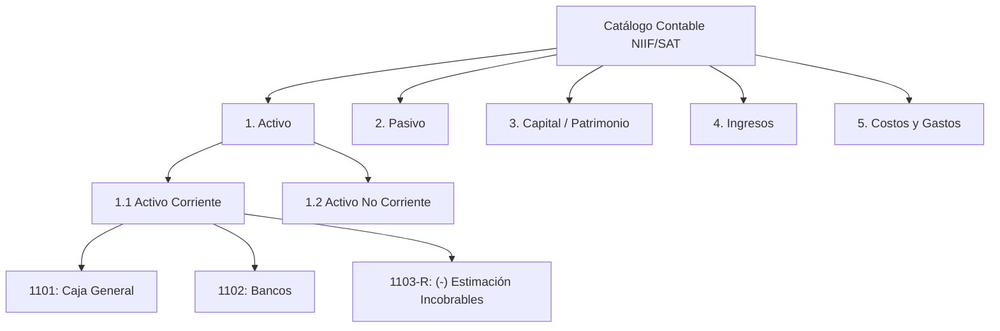

# Guía Práctica: Cómo Extender el Catálogo de Cuentas

Esta guía explica el procedimiento para incorporar nuevas cuentas o subcuentas al Catálogo Contable Central ([`catalogo_contable.py`](../../catalogo_contable.py)), respetando la taxonomía NIIF para PYMES y la lógica de validación del sistema.

---

## 1. Estructura Jerárquica del Catálogo



El catálogo de cuentas está estructurado en tres niveles jerárquicos:

1. **Clase (Nivel 1):** Grandes masas patrimoniales:
   * `1. Activo`
   * `2. Pasivo`
   * `3. Capital / Patrimonio`
   * `4. Ingresos`
   * `5. Costos y Gastos`
2. **Subgrupo (Nivel 2):** Temporalidad o naturaleza de operación:
   * `1.1 Activo Corriente`, `1.2 Activo No Corriente`
   * `2.1 Pasivo Corriente`, `2.2 Pasivo No Corriente`
   * `3.1 Capital Contable`
   * `4.1 Ingresos Ordinarios`, `4.2 Ingresos Extraordinarios`
   * `5.1 Costos`, `5.2 Gastos de Operación`
3. **Cuenta / Subcuenta (Nivel 3 - Hojas):** Diccionario de pares `código: nombre`.

---

## 2. Convención de Códigos y Prefijos

Para mantener la consistencia entre los módulos de apertura, planilla y diario, sigue estas reglas de codificación:

| Tipo de Cuenta | Formato de Código | Ejemplo | Notas |
| :--- | :--- | :--- | :--- |
| **Cuenta Mayor Principal** | 4 dígitos (`XXXX`) | `1101 Caja General` | Cuenta principal de acumulación |
| **Subcuenta Analítica** | 4 dígitos con guion (`XXXX-YY`) | `5201-01 Sueldos Admin` | Desglose departamental o por cliente |
| **Cuenta Regularizadora** | Terminada en `-R` o con prefijo `(-)` | `1103-R Estimación Incobrables` | Resta valor a su clase contable |

---

## 3. Procedimiento para Agregar una Cuenta

Abre el archivo [`catalogo_contable.py`](../../catalogo_contable.py) y localiza la sección correspondiente.

### Ejemplo: Agregar una cuenta para "Inversiones en Bonos del Tesoro"
Dado que es un activo financiero a corto plazo, pertenece a `1. Activo` $\to$ `1.1 Activo Corriente`:

```python
catalogo_cuentas: Dict[str, Dict[str, Dict[str, str]]] = {
    "1. Activo": {
        "1.1 Activo Corriente": {
            "1101": "Caja General",
            "1102": "Bancos (Moneda Nacional)",
            # ...
            "1114": "Inversiones Financieras a Corto Plazo",  # <-- NUEVA CUENTA
        },
        # ...
    }
}
```

### Ejemplo: Agregar una Subcuenta Regularizadora
Para una amortización acumulada de software en `1.2 Activo No Corriente`:

```python
        "1.2 Activo No Corriente": {
            # ...
            "1211": "Programas de Computación (Software)",
            "1212": "(-) Amortización Acumulada Software",     # <-- CUENTA REGULARIZADORA
        }
```

---

## 4. Validación Automatizada

Tras editar [`catalogo_contable.py`](../../catalogo_contable.py), ejecuta las pruebas unitarias para confirmar que las funciones de navegación y búsqueda difusa sigan operando correctamente:

```powershell
pytest tests/test_catalogo.py -v
```

El test verificará:
* Que no existan códigos duplicados.
* Que los nombres normalizados respondan a búsquedas por palabra clave.
* Que las cuentas regularizadoras sean identificadas por [`es_cuenta_regularizadora`](../../catalogo_contable.py).
