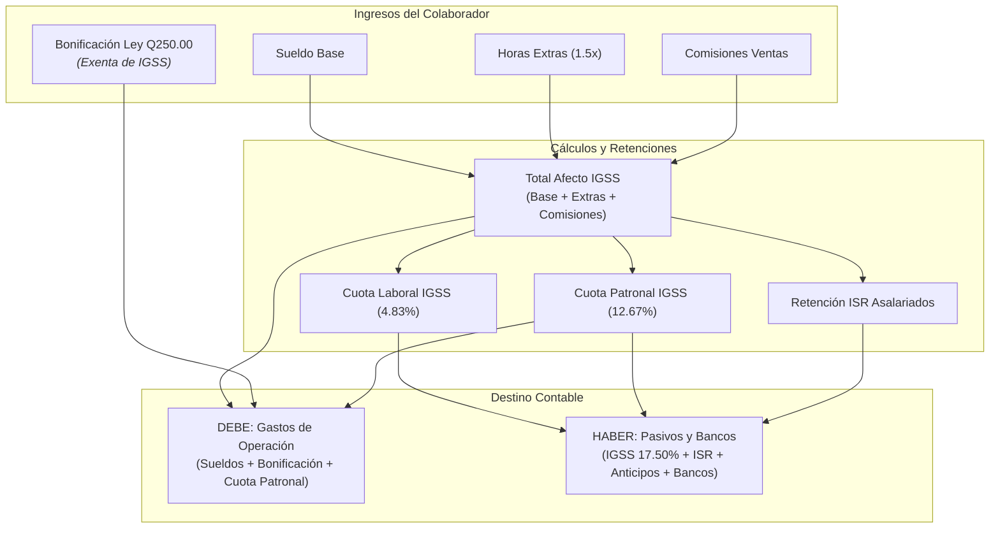

# Guía Práctica: Cómo Procesar Nóminas y Planillas

Esta guía detalla el procedimiento para calcular la nómina salarial mensual o quincenal, aplicar la legislación laboral y tributaria de Guatemala (IGSS, ISR, Bonificación Ley 78-89) y emitir la partida contable consolidada.

---

## 1. Parámetros de Cálculo Legal (Guatemala)

Todo cálculo de planilla en el sistema se basa en los siguientes principios legales:

| Concepto | Tasa / Valor | Base Legal | Afecto a IGSS |
| :--- | :---: | :--- | :---: |
| **Sueldo Base** | Acordado en contrato | Código de Trabajo | Sí |
| **Horas Extras** | Factor 1.5 sobre hora ordinaria | Art. 121 Código de Trabajo | Sí |
| **Comisiones sobre Ventas** | Variable | Código de Trabajo | Sí |
| **Bonificación Incentivo** | **Q 250.00 / mes** | Decretos 78-89 y 37-2001 | **No** |
| **Cuota Laboral IGSS** | **4.83%** | Acuerdo 1118 JD IGSS | Sobre devengado afecto |
| **Cuota Patronal IGSS** | **12.67%** (10.67% IGSS + 1% IRTRA + 1% INTECAP) | Decreto 295 / Ley Orgánica | Sobre devengado afecto |
| **Retención ISR Asalariados** | 5% / 7% escala proyectada | Libro I, Decreto 10-2012 | Sobre renta imponible |

---

## 2. Modalidades de Ingreso de Datos

El sistema soporta dos vías para cargar la información de los empleados:

### Modalidad A: Flujo Interactivo por Consola
Ideal para empresas pequeñas o liquidaciones rápidas de pocos colaboradores:
1. Ejecuta:
   ```powershell
   python planillas.py
   ```
2. Selecciona la opción **[1] Ingreso interactivo de empleados**.
3. El sistema solicitará uno a uno los campos obligatorios y opcionales:
   * Nombre del colaborador.
   * Departamento: `Administración` o `Ventas`.
   * Sueldo base mensual.
   * Horas extras trabajadas en el período.
   * Si es de Ventas: monto de ventas facturadas y porcentaje pactado de comisión.
   * Anticipos, préstamos o descuentos judiciales aplicables.

### Modalidad B: Carga Masiva Mediante Archivo CSV
Ideal para nóminas medianas y grandes:
1. Dentro del menú de `planillas.py`, selecciona **[2] Herramientas CSV**.
2. Opción **[1] Generar plantilla CSV de ejemplo**: creará el archivo `plantilla_empleados.csv`.
3. Abre el archivo en Excel o en un editor de texto y completa las columnas requeridas:
   ```csv
   nombre,departamento,sueldo_base,horas_extras,ventas,pct_comision,prestamos_deudas,otros_descuentos
   Mario Estrada,Administración,6500.00,5,0,0,300.00,0
   Sofia Reyes,Ventas,4200.00,0,75000.00,4.0,0,0
   ```
4. Selecciona la opción **[2] Cargar y procesar empleados desde CSV**: el sistema validará tipos de datos numéricos y procesará toda la nómina en un solo paso.

---

## 3. Emisión de Boletas de Pago

Para cada empleado procesado, el sistema genera una boleta individual que contiene:
* Encabezado con identificación del colaborador y departamento.
* Sección de Ingresos (Sueldo base, horas extras, comisiones, bonificación legal y total devengado).
* Sección de Descuentos (IGSS laboral, retención ISR, anticipos y préstamos).
* Monto líquido final a pagar.

## Esquema de Liquidación y Cargas Laborales



---

## 4. Generación y Cuadre de la Partida Contable

Al concluir la nómina, se ejecuta la función [`generar_partida_contable`](../../planillas.py):

### Cuentas al Debe (Gastos del Período)
* Se separan estrictamente los gastos de acuerdo al departamento del empleado:
  * `5201-01` Sueldos de Administración
  * `5201-02` Bonificación Incentivo Administración
  * `5201-03` Cuota Patronal Administración ($12.67\%$)
  * `5202-01` Sueldos Sala de Ventas (incluyendo comisiones)
  * `5202-02` Bonificación Incentivo Ventas
  * `5202-03` Cuota Patronal Ventas ($12.67\%$)

### Cuentas al Haber (Pasivos y Erogaciones)
* `2104-01` Cuotas IGSS por Pagar: Acumula el $4.83\%$ laboral retenido al trabajador más el $12.67\%$ patronal asumido por la empresa (Total: $17.50\%$).
* `2104-02` Retención ISR por Pagar: Valor retenido a empleados afectos.
* `1111` Anticipos sobre Sueldos: Amortización de deudas o anticipos otorgados previamente.
* `1102` Bancos (Moneda Nacional): Salida líquida total en cheques o transferencias electrónicas.

El motor evalúa:
$$\text{Diferencia} = |\sum \text{Debe} - \sum \text{Haber}|$$
Si la diferencia es estrictamente `Decimal('0.00')`, la partida queda aprobada para su inserción en el Libro Diario.
