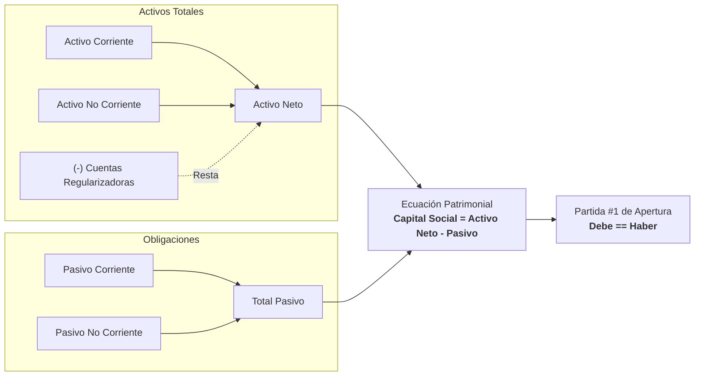

# Guía Práctica: Cómo Registrar la Apertura de una Empresa

Esta guía explica el procedimiento operativo y contable para registrar el inventario inicial de una entidad comercial, tratar adecuadamente las cuentas regularizadoras de activo y generar el Balance de Situación Inicial junto a la Partida #1.

---

## 1. Reglas de Negocio y Clasificación

En Guatemala, el Balance de Situación General de Apertura se rige por las NIIF para PYMES y los requerimientos del Código de Comercio (Art. 368 al 373).

Las cuentas deben clasificarse rigurosamente en:
* **Activo Corriente:** Bienes y derechos de disponibilidad inmediata o realizables en menos de un año (Caja, Bancos, Cuentas por Cobrar, Inventarios, Crédito Fiscal IVA).
* **Activo No Corriente:** Bienes de uso duradero (Terrenos, Edificios, Maquinaria, Mobiliario, Vehículos).
* **Cuentas Regularizadoras (-R):** Cuentas con saldo de naturaleza contraria que restan valor en el activo (ej. `(-) Depreciación Acumulada`, `(-) Estimación para Cuentas Incobrables`).
* **Pasivo Corriente:** Obligaciones exigibles a corto plazo (Proveedores, Cuentas por Pagar, Impuestos).
* **Pasivo No Corriente:** Deudas a más de un año (Hipotecas, Préstamos Bancarios Largo Plazo).
* **Capital Contable:** Calculado mediante la ecuación patrimonial:
  $$\text{Capital Social} = \text{Total Activos Netos} - \text{Total Pasivos}$$



---

## 2. Flujo Operativo Paso a Paso

### Paso 1: Iniciar el Asistente de Apertura
Ejecuta en tu terminal:
```powershell
python apertura-cuentas.py
```

### Paso 2: Ingreso de Cuentas y Normalización
El sistema cuenta con un motor de búsqueda difusa y normalización de texto. Puedes escribir nombres exactos o variaciones comunes:

```text
Ingrese el nombre de la cuenta (o 'fin' para terminar): caja
Cuenta detectada: [1101] Caja General (Activo Corriente)
Ingrese el monto en Quetzales: 12500.50
```

### Paso 3: Manejo de Cuentas Regularizadoras
Si la empresa inicia con bienes usados o traspasados que ya tienen depreciación acumulada:
1. Registra el bien por su costo histórico (ej. `Vehículos`: Q 80,000.00).
2. Registra la cuenta regularizadora (ej. `Depreciación Acumulada Vehículos`: Q 16,000.00).
3. **El sistema detecta automáticamente el prefijo `(-)` y resta el valor en el Activo**, sin que debas ingresar números negativos.

### Paso 4: Finalización y Cuadre Automático
Escribe `fin` cuando hayas concluido. El motor ejecutará:
1. Validación de existencia de activos.
2. Cálculo de sumatorias de activo corriente, no corriente y deducción de regularizadoras.
3. Sumatoria de pasivos.
4. Generación de la cuenta `3101 Capital Social` con el monto exacto para garantizar la partida doble.

---

## 3. Ejemplo de Caso Complejo con Regularizadoras

### Entrada:
* Caja General: `Q 20,000.00`
* Bancos: `Q 65,000.00`
* Inventario de Mercancías: `Q 45,000.00`
* Mobiliario y Equipo: `Q 30,000.00`
* (-) Depreciación Acumulada Mobiliario: `Q 6,000.00`
* Proveedores Locales: `Q 25,000.00`

### Cálculo Patrimonial:
* Activo Bruto: $20,000 + 65,000 + 45,000 + 30,000 = Q 160,000.00$
* Regularizadora: $- Q 6,000.00$
* **Total Activo Neto:** $Q 154,000.00$
* **Total Pasivo:** $Q 25,000.00$
* **Capital Social resultante:** $154,000 - 25,000 = Q 129,000.00$

### Partida No. 1 resultante:
```text
Debe:
  1101 Caja General                       Q 20,000.00
  1102 Bancos                             Q 65,000.00
  1104 Inventario de Mercancías           Q 45,000.00
  1204 Mobiliario y Equipo                Q 30,000.00
Haber:
  1205-03 (-) Deprec. Acum. Mobiliario                  Q  6,000.00
  2101    Proveedores Locales                           Q 25,000.00
  3101    Capital Social                                Q 129,000.00
---------------------------------------------------------------------
SUMAS IGUALES:                            Q 160,000.00  Q 160,000.00
```
*(Nota técnica: En la partida contable, la cuenta regularizadora se abona al Haber para saldar algebraicamente el costo del activo cargado al Debe).*

---

## 4. Pruebas Automatizadas del Módulo

Puedes validar la integridad del módulo ejecutando la suite de pruebas:
```powershell
pytest tests/test_apertura.py -v
```
Estas pruebas verifican la cuadratura matemática, la búsqueda difusa de cuentas y la inmutabilidad de los cálculos con `Decimal`.
