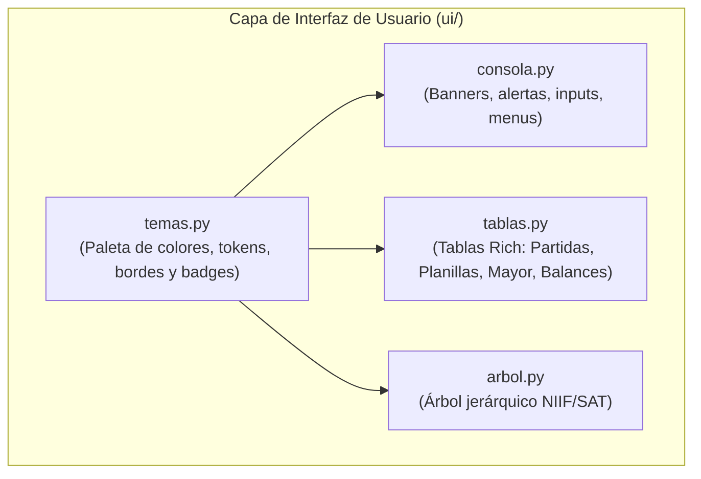
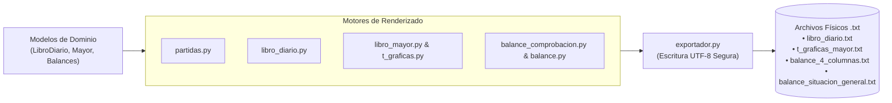

# Referencia: Interfaz de Terminal (`ui/`) y Sistema de Reportes (`reportes/`)

Este documento especifica los componentes, temas visuales, utilidades de consola y generadores de reportes que integran la capa de presentación y exportación del sistema contable.

---

## 1. Módulo de Presentación en Terminal (`ui/`)

Ubicación: [`ui/`](../../ui/)  
Tecnología base: [`rich`](https://rich.readthedocs.io/)

El paquete `ui/` centraliza todo el formateo visual, control de menús y generación de tablas para la terminal interactiva, desacoplado de la lógica matemática del negocio.



### 1.1 Constantes de Diseño y Tema (`ui.temas`)

Define la identidad visual y estándares de accesibilidad para la terminal:

```python
# Paleta de Colores
COLOR_PRIMARIO: str = "bold cyan"        # Títulos y encabezados de sección
COLOR_SECUNDARIO: str = "cyan"            # Subtítulos y metadatos
COLOR_EXITO: str = "bold green"           # Asientos cuadrados, operaciones válidas
COLOR_AVISO: str = "bold yellow"          # Alertas preventivas y confirmaciones
COLOR_ERROR: str = "bold red"             # Descuadres contables y errores de validación
COLOR_TEXTO: str = "white"                # Datos y texto informativo

# Badges de Estado Contable
BADGE_CUADRADO: str = "[bold green][CUADRA][/bold green]"
BADGE_DESCUADRADO: str = "[bold red][DESCUADRE][/bold red]"

# Estilos de Bordes (box)
BORDE_TABLA = box.ROUNDED                 # Tablas principales de estados y balances
BORDE_PANEL = box.ROUNDED                 # Paneles informativos y banners
BORDE_COMPACTO = box.SIMPLE               # Listados secundarios
BORDE_T_GRAFICA = box.HEAVY_HEAD          # Representación formal de cuentas T
```

### 1.2 Utilidades de Consola (`ui.consola`)

Funciones interactivas de alto nivel:

| Función | Descripción |
| :--- | :--- |
| `imprimir_banner(titulo: str)` | Renderiza encabezados con panel estilizado y color primario. |
| `imprimir_menu_opciones(opciones, texto_salir, salir_codigo)` | Imprime menú unificado numerado con control de salida. |
| `imprimir_estado_ejercicio(total_partidas, debe, haber, cuadra)` | Muestra en tiempo real el balance y badge de cuadre del ejercicio. |
| `imprimir_exito(mensaje)` / `imprimir_alerta(mensaje)` | Notificaciones visuales estandarizadas. |
| `pedir_confirmacion(mensaje, default)` | Solicita confirmaciones interactivas `(S/n)` con valor predeterminado. |
| `formatear_moneda(monto: Decimal) -> str` | Convierte un `Decimal` en cadena monetaria guatemalteca (`Q 1,234.56`). |

### 1.3 Generadores de Tablas Rich (`ui.tablas`)

Construye representaciones tabulares optimizadas para visualización en terminal:

* `generar_tabla_partida(partida) -> Table`: Formato formal a 2 columnas con sangría en abonos y pie de sumas iguales.
* `generar_tabla_t_grafica(cuenta_mayor) -> Table`: Esquema visual de cuenta T con débitos a la izquierda, créditos a la derecha y saldo de cierre.
* `generar_tabla_balance_4_columnas(balance) -> Table`: Matriz completa de Sumas (Debe/Haber) y Saldos (Deudor/Acreedor).
* `generar_tabla_balance_general(balance_general) -> Table`: Estado de Situación General clasificado en Activo, Pasivo y Patrimonio.
* `generar_tabla_boleta(resultado_planilla) -> Table`: Boleta individual de nómina con percepciones y deducciones (IGSS, ISR).

### 1.4 Navegación Jerárquica (`ui.arbol`)

* `generar_arbol_catalogo() -> Tree`: Construye un árbol jerárquico navegable con todas las cuentas del catálogo NIIF/SAT organizado por Clases (1 Activo, 2 Pasivo, 3 Patrimonio, 4 Ingresos, 5 Costos y Gastos).

---

## 2. Sistema de Reportes y Exportación (`reportes/`)

Ubicación: [`reportes/`](../../reportes/)

El subsistema `reportes/` produce versiones en texto plano (`.txt`) listas para imprimir, almacenar en archivos de auditoría o enviar por canales externos, garantizando compatibilidad sin dependencias gráficas.



### 2.1 Generadores de Contenido de Texto

| Módulo | Función Principal | Formato / Salida |
| :--- | :--- | :--- |
| `reportes.partidas` | `generar_texto_partida(partida)` | Asiento individual con encabezado, sangría normada y sumas iguales. |
| `reportes.libro_diario` | `generar_texto_libro_diario(libro)` | Libro Diario completo con foliado correlativo y totales acumulados. |
| `reportes.libro_mayor` | `generar_texto_libro_mayor_formal(mayor)` | Mayor a 3 columnas con saldo continuo fecha a fecha. |
| `reportes.t_graficas` | `generar_texto_todas_t_graficas(mayor)` | Cuadernillo completo de cuentas T agrupadas con saldos de cierre. |
| `reportes.balance_comprobacion` | `generar_texto_balance_4_columnas(balance)` | Balance de comprobación y saldos tabulado a 4 columnas. |
| `reportes.balance` | `generar_texto_balance_general_cierre(bg)` | Balance de Situación General de Cierre clasificado conforme a NIIF. |

### 2.2 Utilidades de Guardado Físico (`reportes.exportador`)

* **`exportar_archivo_texto(contenido: str, ruta_archivo: str) -> str`**:
  - Asegura la creación automática de directorios intermedios.
  - Guarda el contenido en codificación `utf-8`.
  - Retorna la ruta absoluta del archivo generado para confirmación al usuario.
