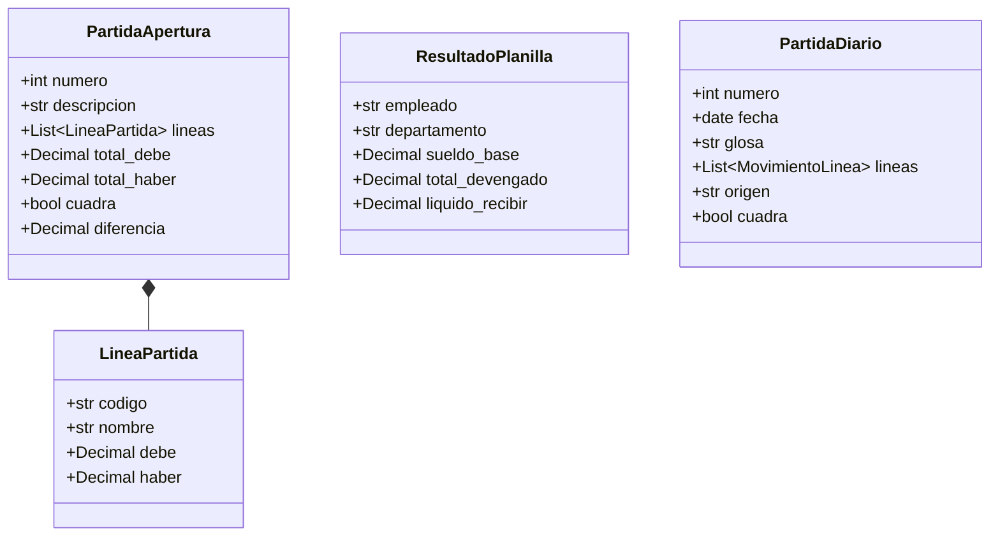

# Referencia: Modelos de Datos y Dataclasses

Este documento especifica los tipos de datos, clases fuertemente tipadas y propiedades calculadas que componen el núcleo contable del sistema.

---

## 1. Módulo de Apertura (`apertura.models`)

Ubicación: [`apertura/models.py`](../../apertura/models.py)



### `CuentaCatalogo`
Representa una definición de cuenta extraída del catálogo para propósitos de autocompletado y validación.
```python
@dataclass
class CuentaCatalogo:
    codigo: str
    nombre: str
    nombre_norm: str
    clase: str
    subgrupo: str
    es_regularizadora: bool = False
```

### `ItemCuentaApertura`
Representa una cuenta con su saldo capturado durante el proceso de inventario inicial.
```python
@dataclass
class ItemCuentaApertura:
    codigo: str
    nombre: str
    monto: Decimal
    clase: str
    subgrupo: str
    es_regularizadora: bool = False
```

### `LineaPartida`
Línea unitaria de cargo o abono dentro de un asiento.
```python
@dataclass
class LineaPartida:
    codigo: str
    nombre: str
    debe: Decimal = Decimal("0.00")
    haber: Decimal = Decimal("0.00")
```

### `PartidaApertura`
Representa la Partida #1 con validación matemática de cuadre.
```python
@dataclass
class PartidaApertura:
    numero: int
    descripcion: str
    lineas: List[LineaPartida] = field(default_factory=list)
    total_debe: Decimal = Decimal("0.00")
    total_haber: Decimal = Decimal("0.00")

    @property
    def cuadra(self) -> bool:
        """Retorna True si y solo si total_debe == total_haber."""
        return self.total_debe == self.total_haber

    @property
    def diferencia(self) -> Decimal:
        """Retorna la diferencia absoluta entre el Debe y el Haber."""
        return abs(self.total_debe - self.total_haber)
```

### `ResumenBalance`
Estructura agregada que alimenta el reporte formal del Balance de Situación General.
```python
@dataclass
class ResumenBalance:
    total_activo: Decimal
    total_pasivo: Decimal
    total_patrimonio: Decimal
    diferencia_capital: Decimal
    estructura_balance: Dict[str, Dict[str, Dict[str, ItemCuentaApertura]]]

    @property
    def total_pasivo_y_patrimonio(self) -> Decimal:
        return self.total_pasivo + self.total_patrimonio

    @property
    def cuadra(self) -> bool:
        return self.total_activo == self.total_pasivo_y_patrimonio
```

---

## 2. Módulo de Planillas (`planilla.models`)

Ubicación: [`planilla/models.py`](../../planilla/models.py)

### `DatosEmpleado`
Entrada de datos crudos para el cálculo de un colaborador.
```python
@dataclass
class DatosEmpleado:
    nombre: str
    sueldo_base: Decimal
    departamento: str = "Administración"  # "Administración" o "Ventas"
    ventas: Decimal = Decimal("0.00")
    pct_comision: Decimal = Decimal("0.00")
    horas_extras: Decimal = Decimal("0.00")
    prestamos_deudas: Decimal = Decimal("0.00")
    otros_descuentos: Decimal = Decimal("0.00")
    isr_manual: Optional[Decimal] = None
    jornada_horas: Decimal = Decimal("8.0")
```

### `ResultadoPlanilla`
Estructura de salida para la boleta de pago y acumulados de nómina.
```python
@dataclass
class ResultadoPlanilla:
    empleado: str
    departamento: str
    sueldo_base: Decimal
    comisiones: Decimal
    horas_extras_trabajadas: Decimal
    sueldo_extraordinario: Decimal
    bonificacion_ley: Decimal
    total_afecto_igss: Decimal
    total_devengado: Decimal
    descuento_igss: Decimal
    descuento_isr: Decimal
    prestamos_deudas: Decimal
    otros_descuentos: Decimal
    total_descuentos: Decimal
    liquido_recibir: Decimal
```

### `PartidaContable`
Asiento consolidado de planilla listo para integrarse al Libro Diario.
```python
@dataclass
class PartidaContable:
    debe: List[Tuple[str, Decimal]] = field(default_factory=list)
    haber: List[Tuple[str, Decimal]] = field(default_factory=list)
    total_debe: Decimal = Decimal("0.00")
    total_haber: Decimal = Decimal("0.00")
    cuadra: bool = True
    diferencia: Decimal = Decimal("0.00")
```

---

## 3. Modelo Unificado para el Libro Diario (`diario.models`)

Para la consolidación de todos los asientos del ciclo contable, se utiliza la especificación unificada:

```python
@dataclass
class MovimientoLinea:
    codigo: str
    nombre: str
    debe: Decimal = Decimal("0.00")
    haber: Decimal = Decimal("0.00")

@dataclass
class PartidaDiario:
    numero: int
    fecha: date
    glosa: str
    lineas: List[MovimientoLinea]
    origen: str  # "APERTURA", "PLANILLA", "VENTA", "COMPRA", "AJUSTE"

    @property
    def total_debe(self) -> Decimal:
        return sum(l.debe for l in self.lineas)

    @property
    def total_haber(self) -> Decimal:
        return sum(l.haber for l in self.lineas)

    @property
    def cuadra(self) -> bool:
        return self.total_debe == self.total_haber
```
