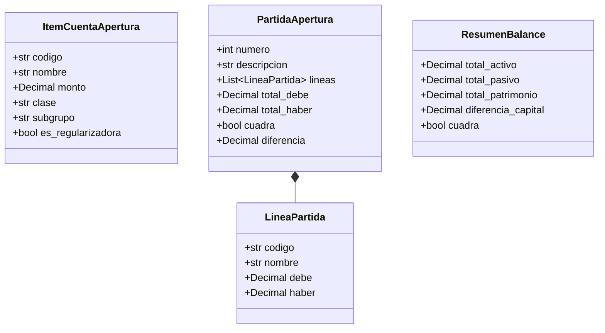

# Referencia: Modelos de Datos y Dataclasses

Este documento especifica los tipos de datos, clases fuertemente tipadas y propiedades calculadas que componen el núcleo contable del sistema a través de todos sus subsistemas: Apertura, Planilla, Diario, Mayor, Balances y Persistencia.

---

## 1. Módulo de Apertura (`apertura.models`)

Ubicación: [`apertura/models.py`](../../apertura/models.py)



### `CuentaCatalogo`
Representa una definición de cuenta extraída del catálogo para propósitos de autocompletado y validación.
```python
@dataclass
class CuentaCatalogo:
    codigo: str
    nombre: str
    nombre_norm: str
    clase: str
    subgrupo: str
    es_regularizadora: bool = False
```

### `ItemCuentaApertura`
Representa una cuenta con su saldo capturado durante el proceso de inventario inicial.
```python
@dataclass
class ItemCuentaApertura:
    codigo: str
    nombre: str
    monto: Decimal
    clase: str
    subgrupo: str
    es_regularizadora: bool = False
```

### `LineaPartida`
Línea unitaria de cargo o abono dentro del asiento de apertura.
```python
@dataclass
class LineaPartida:
    codigo: str
    nombre: str
    debe: Decimal = Decimal("0.00")
    haber: Decimal = Decimal("0.00")
```

### `PartidaApertura`
Representa la Partida #1 con validación matemática de cuadre.
```python
@dataclass
class PartidaApertura:
    numero: int
    descripcion: str
    lineas: List[LineaPartida] = field(default_factory=list)
    total_debe: Decimal = Decimal("0.00")
    total_haber: Decimal = Decimal("0.00")

    @property
    def cuadra(self) -> bool:
        """Retorna True si y solo si total_debe == total_haber."""
        return self.total_debe == self.total_haber

    @property
    def diferencia(self) -> Decimal:
        """Retorna la diferencia absoluta entre el Debe y el Haber."""
        return abs(self.total_debe - self.total_haber)
```

---

## 2. Módulo de Planillas (`planilla.models`)

Ubicación: [`planilla/models.py`](../../planilla/models.py)

### `DatosEmpleado`
Entrada de datos crudos para el cálculo laboral de un colaborador.
```python
@dataclass
class DatosEmpleado:
    nombre: str
    sueldo_base: Decimal
    departamento: str = "Administración"  # "Administración" o "Ventas"
    ventas: Decimal = Decimal("0.00")
    pct_comision: Decimal = Decimal("0.00")
    horas_extras: Decimal = Decimal("0.00")
    prestamos_deudas: Decimal = Decimal("0.00")
    otros_descuentos: Decimal = Decimal("0.00")
    isr_manual: Optional[Decimal] = None
    jornada_horas: Decimal = Decimal("8.0")
```

### `ResultadoPlanilla`
Estructura de salida para la boleta de pago y acumulados de nómina.
```python
@dataclass
class ResultadoPlanilla:
    empleado: str
    departamento: str
    sueldo_base: Decimal
    comisiones: Decimal
    horas_extras_trabajadas: Decimal
    sueldo_extraordinario: Decimal
    bonificacion_ley: Decimal
    total_afecto_igss: Decimal
    total_devengado: Decimal
    descuento_igss: Decimal
    descuento_isr: Decimal
    prestamos_deudas: Decimal
    otros_descuentos: Decimal
    total_descuentos: Decimal
    liquido_recibir: Decimal
```

### `PartidaContable`
Asiento transitorio de planilla listo para integrarse al Libro Diario.
```python
@dataclass
class PartidaContable:
    debe: List[Tuple[str, Decimal]] = field(default_factory=list)
    haber: List[Tuple[str, Decimal]] = field(default_factory=list)
    total_debe: Decimal = Decimal("0.00")
    total_haber: Decimal = Decimal("0.00")
    cuadra: bool = True
    diferencia: Decimal = Decimal("0.00")
```

---

## 3. Módulo de Libro Diario (`diario.models`)

Ubicación: [`diario/models.py`](../../diario/models.py)

### `TipoOrigenPartida`
Clasificación tipada de procedencia del asiento contable.
```python
class TipoOrigenPartida(str, Enum):
    APERTURA = "APERTURA"
    PLANILLA = "PLANILLA"
    COMPRA = "COMPRA"
    VENTA = "VENTA"
    OPERACION = "OPERACION"
    AJUSTE = "AJUSTE"
    CIERRE = "CIERRE"
    MANUAL = "MANUAL"
```

### `MovimientoLinea`
Línea individual de asiento contable validada contra valores negativos y mutua exclusión.
```python
@dataclass
class MovimientoLinea:
    codigo: str
    nombre: str
    debe: Decimal = Decimal("0.00")
    haber: Decimal = Decimal("0.00")

    @property
    def es_cargo(self) -> bool:
        return self.debe > Decimal("0.00")

    @property
    def es_abono(self) -> bool:
        return self.haber > Decimal("0.00")

    @property
    def monto(self) -> Decimal:
        return self.debe if self.es_cargo else self.haber
```

### `PartidaDiario`
Asiento contable correlativo del Libro Diario.
```python
@dataclass
class PartidaDiario:
    numero: int
    fecha: date
    glosa: str
    lineas: List[MovimientoLinea] = field(default_factory=list)
    origen: TipoOrigenPartida = TipoOrigenPartida.MANUAL
    documento_soporte: Optional[str] = None

    @property
    def total_debe(self) -> Decimal:
        return sum((l.debe for l in self.lineas), Decimal("0.00")).quantize(TWO_PLACES)

    @property
    def total_haber(self) -> Decimal:
        return sum((l.haber for l in self.lineas), Decimal("0.00")).quantize(TWO_PLACES)

    @property
    def cuadra(self) -> bool:
        return self.total_debe == self.total_haber and len(self.lineas) > 0

    @property
    def diferencia(self) -> Decimal:
        return abs(self.total_debe - self.total_haber).quantize(TWO_PLACES)
```

### `LibroDiario`
Contenedor general de asientos contables del ejercicio.
```python
@dataclass
class LibroDiario:
    partidas: List[PartidaDiario] = field(default_factory=list)

    @property
    def total_debe(self) -> Decimal:
        return sum((p.total_debe for p in self.partidas), Decimal("0.00")).quantize(TWO_PLACES)

    @property
    def total_haber(self) -> Decimal:
        return sum((p.total_haber for p in self.partidas), Decimal("0.00")).quantize(TWO_PLACES)

    @property
    def cuadra(self) -> bool:
        return (self.total_debe == self.total_haber) and all(p.cuadra for p in self.partidas)
```

---

## 4. Módulo de Libro Mayor (`mayor.models`)

Ubicación: [`mayor/models.py`](../../mayor/models.py)

### `NaturalezaSaldo`
```python
class NaturalezaSaldo(str, Enum):
    DEUDOR = "DEUDOR"
    ACREEDOR = "ACREEDOR"
    SALDADA = "SALDADA"
```

### `MovimientoMayor`
Representa un pase individual del Libro Diario hacia una cuenta en el Mayor.
```python
@dataclass
class MovimientoMayor:
    numero_partida: int
    fecha: date
    concepto: str
    debe: Decimal = Decimal("0.00")
    haber: Decimal = Decimal("0.00")
    documento_soporte: Optional[str] = None
    saldo_acumulado: Decimal = Decimal("0.00")
```

### `CuentaMayor`
Acumulador de movimientos de una cuenta, cálculo de saldos y detección de anomalías.
```python
@dataclass
class CuentaMayor:
    codigo: str
    nombre: str
    movimientos: List[MovimientoMayor] = field(default_factory=list)

    @property
    def total_debe(self) -> Decimal:
        return sum((m.debe for m in self.movimientos), Decimal("0.00")).quantize(TWO_PLACES)

    @property
    def total_haber(self) -> Decimal:
        return sum((m.haber for m in self.movimientos), Decimal("0.00")).quantize(TWO_PLACES)

    @property
    def saldo(self) -> Decimal:
        return abs(self.total_debe - self.total_haber).quantize(TWO_PLACES)

    @property
    def tipo_saldo(self) -> NaturalezaSaldo:
        if self.total_debe > self.total_haber:
            return NaturalezaSaldo.DEUDOR
        elif self.total_haber > self.total_debe:
            return NaturalezaSaldo.ACREEDOR
        return NaturalezaSaldo.SALDADA

    @property
    def es_saldo_anomalo(self) -> bool:
        """Indica si el saldo no nulo contradice la naturaleza contable esperada."""
        if self.tipo_saldo == NaturalezaSaldo.SALDADA:
            return False
        return self.tipo_saldo != self.naturaleza_esperada
```

### `LibroMayor`
Colección de cuentas mayorizadas con comprobación del doble cuadre.
```python
@dataclass
class LibroMayor:
    cuentas: Dict[str, CuentaMayor] = field(default_factory=dict)

    @property
    def cuadra(self) -> bool:
        sumas_iguales = (self.total_debe == self.total_haber)
        saldos_iguales = (self.total_saldos_deudores == self.total_saldos_acreedores)
        return sumas_iguales and saldos_iguales
```

---

## 5. Módulo de Balances (`balance.models`)

Ubicación: [`balance/models.py`](../../balance/models.py)

### `FilaBalance4Columnas`
```python
@dataclass
class FilaBalance4Columnas:
    numero: int
    codigo: str
    nombre: str
    suma_debe: Decimal = Decimal("0.00")
    suma_haber: Decimal = Decimal("0.00")
    saldo_deudor: Decimal = Decimal("0.00")
    saldo_acreedor: Decimal = Decimal("0.00")
    clase: str = ""
    subgrupo: str = ""
    es_regularizadora: bool = False
    es_saldo_anomalo: bool = False
```

### `Balance4Columnas`
Matriz completa del Balance de Comprobación y Saldos.
```python
@dataclass
class Balance4Columnas:
    empresa: str = "Empresa Ejemplo, S.A."
    periodo: str = "2026"
    fecha_emision: date = field(default_factory=date.today)
    filas: List[FilaBalance4Columnas] = field(default_factory=list)

    @property
    def cuadran_sumas(self) -> bool:
        return self.total_debe == self.total_haber

    @property
    def cuadran_saldos(self) -> bool:
        return self.total_saldos_deudores == self.total_saldos_acreedores

    @property
    def cuadra(self) -> bool:
        return self.cuadran_sumas and self.cuadran_saldos
```

### `BalanceSituacionGeneral`
Balance de Situación General de Cierre clasificado conforme a NIIF.
```python
@dataclass
class BalanceSituacionGeneral:
    empresa: str = "Empresa Ejemplo, S.A."
    periodo: str = "2026"
    fecha_emision: date = field(default_factory=date.today)
    total_activo_corriente: Decimal = Decimal("0.00")
    total_activo_no_corriente: Decimal = Decimal("0.00")
    total_activo: Decimal = Decimal("0.00")
    total_pasivo_corriente: Decimal = Decimal("0.00")
    total_pasivo_no_corriente: Decimal = Decimal("0.00")
    total_pasivo: Decimal = Decimal("0.00")
    patrimonio_capital: Decimal = Decimal("0.00")
    patrimonio_reservas: Decimal = Decimal("0.00")
    patrimonio_resultados: Decimal = Decimal("0.00")
    total_patrimonio: Decimal = Decimal("0.00")

    @property
    def total_pasivo_y_patrimonio(self) -> Decimal:
        return self.total_pasivo + self.total_patrimonio

    @property
    def cuadra(self) -> bool:
        return self.total_activo == self.total_pasivo_y_patrimonio
```

---

## 6. Módulo de Persistencia Unificada (`persistencia.models`)

Ubicación: [`persistencia/models.py`](../../persistencia/models.py)

### `EjercicioContable`
Estructura raíz que consolida y serializa el snapshot contable completo:
```python
@dataclass
class EjercicioContable:
    version: str = "1.1"
    nombre_empresa: str = "Empresa Ejemplo, S.A."
    nit: str = ""
    direccion: str = ""
    moneda: str = "GTQ"
    regimen_tributario: str = "Opcional Simplificado sobre Ingresos de Actividades Lucrativas"
    contador_nombre: str = ""
    contador_registro: str = ""
    periodo: str = "2026"
    fecha_inicio: Optional[date] = None
    fecha_fin: Optional[date] = None
    cerrado: bool = False
    fecha_creacion: str = field(default_factory=lambda: datetime.now(timezone.utc).isoformat())
    fecha_modificacion: str = field(default_factory=lambda: datetime.now(timezone.utc).isoformat())
    items_apertura: List[ItemCuentaApertura] = field(default_factory=list)
    libro_diario: LibroDiario = field(default_factory=LibroDiario)
    empleados: List[DatosEmpleado] = field(default_factory=list)
    planillas: List[ResultadoPlanilla] = field(default_factory=list)

    @property
    def cuadra(self) -> bool:
        """Indica si el libro diario del ejercicio está debidamente balanceado."""
        return self.libro_diario.cuadra

    def generar_mayor(self) -> Any:
        """Genera el Libro Mayor derivado a partir de las partidas del Libro Diario."""
        from mayor.engine import mayorizar_libro_diario
        return mayorizar_libro_diario(self.libro_diario)

    def generar_balance_4_columnas(self) -> Any:
        """Genera el Balance de 4 Columnas derivado a partir del Libro Mayor o Libro Diario."""
        from balance.engine import generar_balance_4_columnas
        return generar_balance_4_columnas(
            self.libro_diario,
            empresa=self.nombre_empresa,
            periodo=self.periodo,
        )
```
