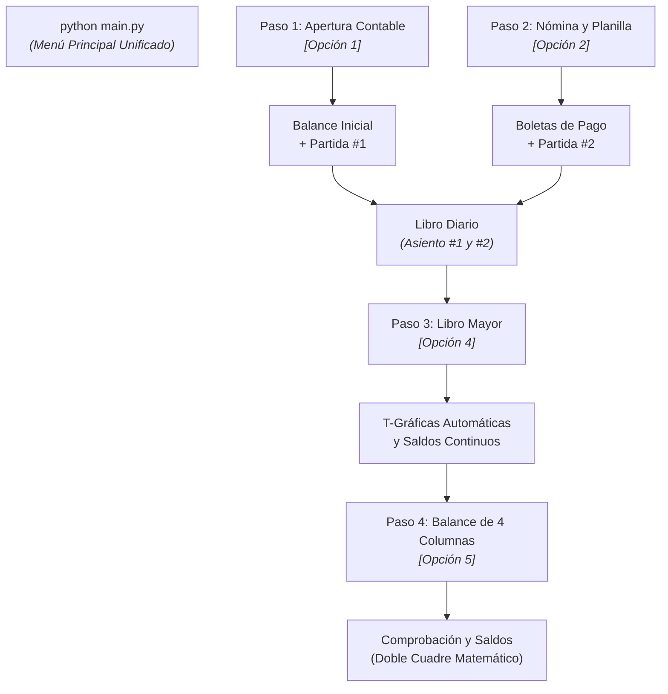

# Tutorial: Tu Primer Ciclo Contable Completo en 15 Minutos

Este tutorial te guiará paso a paso para ejecutar un **Ciclo Contable Completo e Integrado** utilizando el orquestador interactivo del proyecto ([`main.py`](../../main.py)). 

Aprenderás a registrar la apertura de un negocio, liquidar la planilla de sueldos, asentar ambas operaciones en el Libro Diario, mayorizar automáticamente las cuentas contables y emitir el Balance de Comprobación de 4 Columnas con doble cuadre perfecto.

---

## Prerrequisitos

* Tener instalado **Python 3.10** o superior en tu sistema.
* Entorno virtual activado con las dependencias instaladas:
  ```bash
  pip install -r requirements.txt
  ```
* Estar ubicado en la raíz del repositorio.

---

## Flujo del Tutorial



---

## Paso 0: Iniciar el Sistema

Ejecuta el orquestador principal:

```bash
python main.py
```

El sistema desplegará el banner corporativo y el estado actual del ejercicio (partidas registradas y balance en `Q 0.00`).

---

## Paso 1: Registrar el Balance de Apertura

Selecciona la opción **`[1] Sistema de Apertura Contable (Inventario y Balance Inicial)`**.

1. Elige **`[1] Ingresar cuentas interactivamente`**.
2. Ingresa los siguientes valores de prueba para constituir la empresa comercial:
   * **Caja General**: `15000`
   * **Bancos (Moneda Nacional)**: `50000`
   * **Inventario de Mercancías**: `35000`
   * **Vehículos**: `40000`
   * **Proveedores Locales**: `20000`
3. Escribe `fin` o presiona Enter sin texto cuando termines de capturar las cuentas.

### ¿Qué hace el sistema?
* Valida las cuentas contra el Catálogo Contable Central ([`catalogo_contable.py`](../../catalogo_contable.py)).
* Suma los activos ($Q 15,000 + Q 50,000 + Q 35,000 + Q 40,000 = Q 140,000.00$).
* Suma los pasivos ($Q 20,000.00$).
* Calcula automáticamente el **Capital Social** por diferencia patrimonial:
  $$\text{Capital} = \text{Activo} - \text{Pasivo} = 140,000 - 20,000 = Q 120,000.00$$
* Muestra la **Partida No. 1** cuadrada a dos columnas ($Q 140,000.00 = Q 140,000.00$).
* Al salir, el sistema te preguntará:
  `¿Deseas asentar esta Apertura como Partida #1 en el Libro Diario? (S/n):`
  **Responde `S` (Sí)** para que se integre al Libro Diario unificado.

---

## Paso 2: Procesar la Primera Planilla de Sueldos

Desde el menú principal, selecciona la opción **`[2] Sistema de Planillas y Nóminas (Cálculo de Sueldos y Boletas)`**.

1. Elige **`[1] Ingreso interactivo de empleados`** (o carga masiva desde `plantilla_empleados.csv`).
2. Ingresa los datos de dos colaboradores de ejemplo:

#### Empleado 1: Administración
* **Nombre:** Carlos Morales
* **Departamento:** Administración
* **Sueldo Base:** `5000.00`
* **Horas Extras:** `10`
* **Ventas / % Comisión:** `0`
* **Préstamos / Anticipos:** `0`

#### Empleado 2: Sala de Ventas
* **Nombre:** Lucía Méndez
* **Departamento:** Ventas
* **Sueldo Base:** `4000.00`
* **Horas Extras:** `0`
* **Ventas Realizadas:** `60000.00`
* **Porcentaje de Comisión:** `3.5`
* **Préstamos / Anticipos:** `200.00`

### Cálculos Legales Automáticos:
* Horas extras calculadas con recargo legal de $1.5$ sobre la jornada diaria.
* Bonificación Incentivo legal de **Q250.00** fija por empleado (Decreto 78-89).
* Deducción de **Cuota Laboral IGSS (4.83%)** sobre ingresos afectos.
* Provisión de **Cuota Patronal IGSS (12.67%)** a cargo de la empresa.

Al finalizar, el orquestador preguntará:
`¿Deseas asentar esta Nómina de Sueldos en el Libro Diario? (S/n):`
**Responde `S` (Sí)**. Se generará y vinculará la **Partida No. 2** en el Libro Diario.

---

## Paso 3: Inspeccionar el Libro Diario

Selecciona la opción **`[3] Sistema de Libro Diario (Registro de Operaciones Diarias)`**.

1. Elige **`[1] Ver Libro Diario completo`**.
2. Observarás ambas partidas correlativas registradas con sus respectivas sangrías y glosas:
   * **Partida #1 (Apertura):** Debe $Q 140,000.00$ | Haber $Q 140,000.00$.
   * **Partida #2 (Planilla):** Cuadrada al centavo con las cuentas de gasto de administración/ventas, cuotas patronales, retenciones y el crédito bancario.
3. El estado del Diario mostrará:
   `LIBRO DIARIO CUADRADO PERFECTAMENTE (Diferencia: Q 0.00)`
4. Presiona `0` para regresar al menú principal.

---

## Paso 4: Mayorizar y Generar T-Gráficas

Selecciona la opción **`[4] Sistema de Libro Mayor y T-Gráficas (Pases y Saldos)`**.

1. Elige **`[1] Ver T-Gráficas en pantalla`**.
2. El sistema agrupará de forma instantánea todos los movimientos de las Partidas #1 y #2 por cuenta:
   * **Caja General (1101):** Saldo Deudor $Q 15,000.00$.
   * **Bancos (1102):** Débito inicial de $Q 50,000.00$ menos el abono por pago de planilla líquida, calculando su nuevo saldo deudor en tiempo real.
   * **Capital Social (3101):** Saldo Acreedor $Q 120,000.00$.
   * Cuentas de Gastos y Pasivos laborales desglosadas.
3. Opcionalmente, puedes exportar las T-Gráficas a disco seleccionando la opción **`[3] Exportar T-Gráficas a archivo de texto`** (se guardará como `t_graficas_mayor.txt`).

---

## Paso 5: Emitir el Balance de 4 Columnas

Selecciona la opción **`[5] Sistema de Balances (4 Columnas y Situación General de Cierre)`**.

1. Elige **`[1] Generar y ver Balance de 4 Columnas`**.
2. La consola desplegará la matriz formal de comprobación y saldos:
   * **Columna 1:** Sumas del Debe.
   * **Columna 2:** Sumas del Haber.
   * **Columna 3:** Saldos Deudores.
   * **Columna 4:** Saldos Acreedores.
3. Al pie de la tabla confirmarás la doble regla de cuadre contable:
   * **Sumas Iguales:** $\sum Debe == \sum Haber$.
   * **Saldos Iguales:** $\sum \text{Saldos Deudores} == \sum \text{Saldos Acreedores}$.
4. Selecciona **`[2] Exportar Balance a archivo de texto`** para conservar el reporte oficial (`balance_4_columnas.txt`).

---

## Paso 6: Guardar el Ejercicio Contable

Regresa al menú principal y presiona **`[0] Salir`** (o entra a `[6] Guardar / Cargar Ejercicio Contable`).

El sistema te preguntará:
`¿Deseas guardar los cambios en 'libro_diario.json' antes de salir? (S/n):`
Presiona Enter o escribe `S`.

Todo el estado del ejercicio (empresa, inventario de apertura, partidas del diario, colaboradores y nóminas) quedará persistido de forma segura en `libro_diario.json`, listo para reanudarse en cualquier momento.

---

## Siguientes Pasos

¡Felicitaciones! Has completado el ciclo contable clásico de principio a fin. Para profundizar en operaciones específicas, consulta:

* [Cómo Estructurar Partidas en el Libro Diario](../how-to/estructurar_partidas_diario.md): Registro de compras con IVA crédito y ventas con IVA débito.
* [Persistencia JSON y Modelo Unificado](../explanation/persistencia_y_modelo_de_datos.md): Cómo funciona la serialización y los respaldos atómicos `.bak`.
* [El Ciclo Contable y el Efecto Dominó](../explanation/ciclo_contable_y_partida_doble.md): Fundamentación matemática de la mayorización desatendida.
