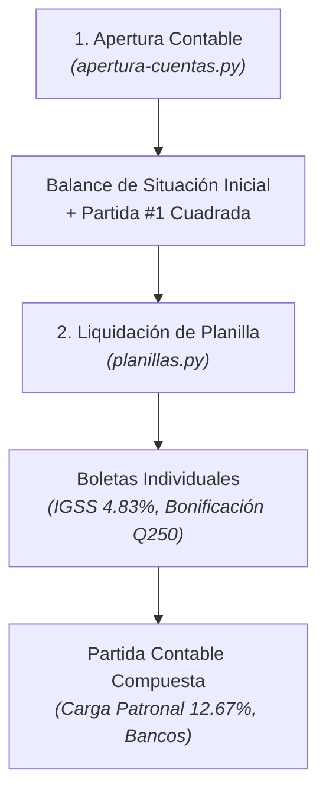

# Tutorial: Tu Primer Ciclo Contable en 15 Minutos

Este tutorial te guiará paso a paso para ejecutar un flujo contable básico utilizando la infraestructura de scripts del proyecto: desde registrar la apertura de un negocio comercial hasta liquidar la nómina del primer mes y generar las respectivas partidas contables cuadradas al centavo.

---

## Prerrequisitos

* Tener instalado **Python 3.10** o superior en tu sistema.
* Estar ubicado en la raíz del repositorio o proyecto:
  ```powershell
  cd <directorio_del_proyecto>
  ```
* No se requieren dependencias externas para la lógica central (utiliza exclusivamente la biblioteca estándar: `decimal`, `dataclasses`, `typing`, `csv`).

---

## Flujo del Tutorial



---

## Paso 1: Ejecutar la Apertura Contable

El punto de partida de toda empresa es el inventario inicial o Balance de Apertura.

1. Ejecuta el asistente interactivo de apertura:
   ```powershell
   python apertura-cuentas.py
   ```
2. El sistema te solicitará ingresar cuentas y sus montos correspondientes. Ingresa el siguiente caso de prueba:
   * **Caja General**: `15000`
   * **Bancos (Moneda Nacional)**: `50000`
   * **Inventario de Mercancías**: `35000`
   * **Vehículos**: `40000`
   * **Proveedores Locales**: `20000`
3. Escribe `fin` o presiona Enter sin texto cuando termines de capturar las cuentas.

### ¿Qué sucede internamente?
* El motor valida cada cuenta contra el Catálogo Contable NIIF/SAT ([`catalogo_contable.py`](../../catalogo_contable.py)).
* Suma los activos ($15,000 + 50,000 + 35,000 + 40,000 = Q 140,000.00$).
* Suma los pasivos ($Q 20,000.00$).
* Calcula automáticamente el **Capital Social** por diferencia patrimonial:
  $$\text{Capital} = \text{Activo} - \text{Pasivo} = 140,000 - 20,000 = Q 120,000.00$$

### Resultado Generado
La consola desplegará el **Balance de Situación General de Apertura** clasificado en Corriente y No Corriente, seguido de la **Partida No. 1** del Libro Diario:

```text
======================================================================
                         PARTIDA CONTABLE NO. 1
                        (Partida de Apertura)
======================================================================
Código    Cuenta                                     Debe        Haber
----------------------------------------------------------------------
1101      Caja General                          15,000.00         0.00
1102      Bancos (Moneda Nacional)              50,000.00         0.00
1104      Inventario de Mercancías              35,000.00         0.00
1206      Vehículos                             40,000.00         0.00
2101         A: Proveedores Locales                  0.00    20,000.00
3101         A: Capital Social                       0.00   120,000.00
----------------------------------------------------------------------
SUMAS IGUALES:                                 140,000.00   140,000.00
[ESTADO]: CUADRADA PERFECTAMENTE (Diferencia: Q0.00)
======================================================================
```

---

## Paso 2: Procesar la Primera Planilla de Sueldos

Al concluir el primer mes de operaciones, corresponde liquidar el pago de sueldos del personal conforme a la ley laboral de Guatemala.

1. Ejecuta el módulo de nómina:
   ```powershell
   python planillas.py
   ```
2. Selecciona la opción **[1] Ingreso interactivo de empleados**.
3. Ingresa los datos de dos empleados de ejemplo:

#### Empleado 1: Administración
* **Nombre:** Carlos Morales
* **Departamento:** Administración
* **Sueldo Base:** `5000.00`
* **Horas Extras:** `10`
* **Ventas / % Comisión:** `0`
* **Préstamos / Anticipos:** `0`

#### Empleado 2: Sala de Ventas
* **Nombre:** Lucía Méndez
* **Departamento:** Ventas
* **Sueldo Base:** `4000.00`
* **Horas Extras:** `0`
* **Ventas Realizadas:** `60000.00`
* **Porcentaje de Comisión:** `3.5`
* **Préstamos / Anticipos:** `200.00`

---

## Paso 3: Análisis de Cálculos y Boleta de Pago

Para cada empleado, el sistema emite su boleta desglosada:
* Aplica el valor de hora extra ordinaria con factor $1.5$ sobre la jornada legal.
* Suma la **Bonificación Incentivo Ley Q250.00** (Decreto 78-89).
* Deduce la **Cuota Laboral IGSS (4.83%)** sobre el total devengado afecto (excluyendo la bonificación).
* Calcula la retención proyectada de **ISR asalariados** si aplica.

Ejemplo de boleta emitida:
```text
============================================================
              BOLETA DE PAGO - PLANILLA MENSUAL
============================================================
Empleado: Carlos Morales | Depto: Administración
Sueldo Base:                  Q 5,000.00
Horas Extras (10.0 hrs):      Q   468.75
Bonificación Incentivo:       Q   250.00
------------------------------------------------------------
TOTAL DEVENGADO:              Q 5,718.75
(-) Cuota Laboral IGSS (4.83%): Q 264.14
(-) Retención ISR:            Q   0.00
------------------------------------------------------------
LÍQUIDO A RECIBIR:            Q 5,454.61
============================================================
```

---

## Paso 4: Generación del Asiento Contable de Nómina

Al finalizar la captura de todos los empleados, el sistema consolida automáticamente la **Partida de Planilla**:
* **Debe:**
  * `5201-01` Sueldos de Administración
  * `5201-02` Bonificación Incentivo Administración
  * `5201-03` Cuota Patronal Administración ($12.67\%$)
  * `5202-01` Sueldos Sala de Ventas + Comisiones
  * `5202-02` Bonificación Incentivo Ventas
  * `5202-03` Cuota Patronal Ventas ($12.67\%$)
* **Haber:**
  * `2104-01` Cuotas IGSS por Pagar (Laboral $4.83\%$ + Patronal $12.67\% = 17.50\%$)
  * `2104-02` Retención ISR por Pagar
  * `1111` Anticipos / Descuentos a Empleados
  * `1102` Bancos (Líquido total a pagar)

El sistema verifica que el asiento cuadre con tolerancia cero:
$$\sum \text{Debe} == \sum \text{Haber}$$

---

## Siguientes Pasos

¡Has completado tu primer ciclo básico! Ahora puedes consultar:
* [Cómo Estructurar Partidas en el Libro Diario](../how-to/estructurar_partidas_diario.md) para registrar compras y ventas.
* [El Ciclo Contable y el Efecto Dominó](../explanation/ciclo_contable_y_partida_doble.md) para entender cómo este asiento se transformará automáticamente en el Libro Mayor y el Balance de 4 Columnas.
